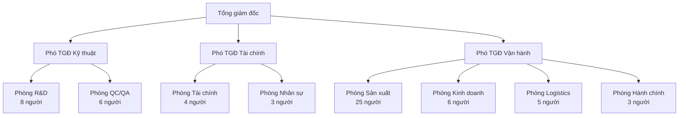
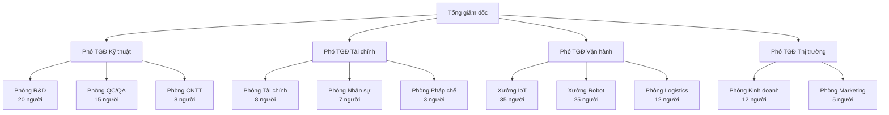

# 13. TỔ CHỨC QUẢN LÝ VÀ BỘ MÁY THỰC HIỆN

## 13.1 Tổng quan Cơ cấu Tổ chức

### 13.1.1 Nguyên tắc tổ chức

Cơ cấu tổ chức của Khu Phức hợp Sản xuất Công nghệ cao Mekong được thiết kế theo nguyên tắc **"Tinh gọn - Hiệu quả - Linh hoạt"** với mục tiêu tối ưu hóa nguồn nhân lực trong giới hạn 300 người và ngân sách 5 triệu USD.

#### Nguyên tắc cốt lõi:
- **Cấu trúc phẳng:** Giảm thiểu cấp bậc trung gian để tăng tốc độ ra quyết định
- **Đa chức năng:** Mỗi nhân viên có khả năng đảm nhận nhiều vai trò
- **Tự chủ cao:** Các bộ phận có quyền tự quyết định trong phạm vi thẩm quyền
- **Học hỏi liên tục:** Văn hóa học tập và chia sẻ kiến thức

#### Đặc điểm tổ chức:
- **Quy mô nhỏ gọn:** Bắt đầu với 60 người, mở rộng dần lên 300 người
- **Công nghệ hỗ trợ:** Sử dụng công nghệ để tăng hiệu quả quản lý
- **Linh hoạt thích ứng:** Có thể điều chỉnh nhanh theo thay đổi thị trường
- **Định hướng kết quả:** Đánh giá dựa trên kết quả công việc, không phải giờ làm việc

### 13.1.2 Mô hình tổ chức theo giai đoạn

#### Giai đoạn 1 (2025-2030): Tổ chức Khởi nghiệp - 60 người

#### Giai đoạn 2 (2030-2040): Tổ chức Phát triển - 150 người

#### Giai đoạn 3 (2040-2060): Tổ chức Trưởng thành - 250 người

#### Giai đoạn 4 (2060-2075): Tổ chức Ổn định - 300 người

## 13.2 Cơ cấu Lãnh đạo và Quản lý

### 13.2.1 Hội đồng quản trị

#### Thành phần và nhiệm vụ:

**Chủ tịch Hội đồng quản trị:**
- **Nhiệm vụ:** Định hướng chiến lược dài hạn, giám sát hoạt động
- **Yêu cầu:** >15 năm kinh nghiệm quản lý, hiểu biết về công nghệ
- **Thời gian:** Chuyên trách, cam kết 50 năm

**Thành viên HĐQT (4 người):**
- **Đại diện nhà đầu tư:** 2 người
- **Chuyên gia độc lập:** 1 người (tài chính/kỹ thuật)
- **Đại diện nhân viên:** 1 người (được bầu chọn)

**Quyền hạn và trách nhiệm:**
- Quyết định chiến lược đầu tư >500.000 USD
- Phê duyệt ngân sách hàng năm
- Bổ nhiệm và đánh giá Ban Tổng giám đốc
- Giám sát tuân thủ pháp luật và quy định

### 13.2.2 Ban Tổng giám đốc

#### Tổng giám đốc (CEO):

**Hồ sơ năng lực:**
- **Học vấn:** Thạc sĩ Quản trị Kinh doanh + Kỹ thuật
- **Kinh nghiệm:** >10 năm quản lý doanh nghiệp công nghệ
- **Kỹ năng:** Lãnh đạo, chiến lược, đàm phán quốc tế
- **Ngôn ngữ:** Tiếng Việt, Tiếng Anh thành thạo

**Nhiệm vụ chính:**
- Xây dựng và triển khai chiến lược công ty
- Quản lý tổng thể hoạt động kinh doanh
- Đại diện công ty đối ngoại
- Báo cáo HĐQT và cổ đông

#### Phó Tổng giám đốc Kỹ thuật (CTO):

**Hồ sơ năng lực:**
- **Học vấn:** Tiến sĩ Kỹ thuật Điện tử/Cơ khí/Tin học
- **Kinh nghiệm:** >8 năm R&D và quản lý kỹ thuật
- **Chuyên môn:** IoT, Robot, AI, Industry 4.0
- **Chứng chỉ:** PMP, Lean Six Sigma Black Belt

**Nhiệm vụ chính:**
- Định hướng công nghệ và R&D
- Quản lý chất lượng sản phẩm
- Phát triển đội ngũ kỹ thuật
- Hợp tác với các trường đại học và viện nghiên cứu

#### Phó Tổng giám đốc Tài chính (CFO):

**Hồ sơ năng lực:**
- **Học vấn:** Thạc sĩ Tài chính/Kế toán
- **Kinh nghiệm:** >8 năm quản lý tài chính doanh nghiệp
- **Chứng chỉ:** CPA/ACCA/CFA
- **Kỹ năng:** Phân tích tài chính, quản lý rủi ro, tuân thủ

**Nhiệm vụ chính:**
- Quản lý tài chính và kế toán
- Lập kế hoạch ngân sách và dự báo
- Quản lý nhân sự và hành chính
- Đảm bảo tuân thủ pháp luật

#### Phó Tổng giám đốc Vận hành (COO):

**Hồ sơ năng lực:**
- **Học vấn:** Cử nhân Quản trị Sản xuất/Kỹ thuật
- **Kinh nghiệm:** >8 năm quản lý sản xuất và vận hành
- **Chuyên môn:** Lean Manufacturing, Supply Chain
- **Chứng chỉ:** Six Sigma, ISO 9001 Lead Auditor

**Nhiệm vụ chính:**
- Quản lý sản xuất và chất lượng
- Tối ưu hóa quy trình vận hành
- Quản lý chuỗi cung ứng
- Đảm bảo an toàn lao động

### 13.2.3 Cấu trúc báo cáo và ra quyết định

#### Hệ thống báo cáo:

**Báo cáo hàng ngày:**
- Trưởng phòng → Phó TGĐ: Tình hình hoạt động
- Phó TGĐ → TGĐ: Tóm tắt các vấn đề quan trọng
- TGĐ → HĐQT: Báo cáo khẩn cấp (nếu có)

**Báo cáo hàng tuần:**
- Họp Ban Tổng giám đốc: Thứ 2 hàng tuần
- Đánh giá KPI và tiến độ công việc
- Quyết định các vấn đề cấp bách
- Phối hợp giữa các bộ phận

**Báo cáo hàng tháng:**
- Họp toàn thể cán bộ quản lý
- Báo cáo tài chính và kinh doanh
- Đánh giá hiệu quả hoạt động
- Kế hoạch tháng tiếp theo

#### Thẩm quyền ra quyết định:

| Mức giá trị | Người có thẩm quyền | Thời gian phê duyệt |
|-------------|-------------------|-------------------|
| < 5.000 USD | Trưởng phòng | 1 ngày |
| 5.000 - 25.000 USD | Phó TGĐ | 2 ngày |
| 25.000 - 100.000 USD | TGĐ | 3 ngày |
| 100.000 - 500.000 USD | TGĐ + 2 Phó TGĐ | 1 tuần |
| > 500.000 USD | HĐQT | 2 tuần |

## 13.3 Cơ cấu Bộ phận Chức năng

### 13.3.1 Phòng Nghiên cứu và Phát triển (R&D)

#### Cơ cấu tổ chức:

**Trưởng phòng R&D:**
- **Học vấn:** Tiến sĩ Kỹ thuật hoặc Thạc sĩ + 10 năm kinh nghiệm
- **Chuyên môn:** IoT, Robotics, AI/ML
- **Nhiệm vụ:** Định hướng R&D, quản lý dự án nghiên cứu

**Nhóm IoT Gateway (4 người):**
- Trưởng nhóm (1): Thạc sĩ Điện tử/Viễn thông
- Kỹ sư phần cứng (2): Thiết kế PCB, MCU
- Kỹ sư phần mềm (1): Embedded C/C++, Python

**Nhóm Robot AMR (4 người):**
- Trưởng nhóm (1): Thạc sĩ Cơ khí/Điều khiển tự động
- Kỹ sư cơ khí (1): Thiết kế kết cấu, CAD/CAM
- Kỹ sư điều khiển (1): SLAM, Navigation, ROS
- Kỹ sư AI (1): Machine Learning, Computer Vision

#### Mục tiêu và KPI:

**Mục tiêu nghiên cứu:**
- Phát triển 2-3 sản phẩm mới mỗi năm
- Cải tiến sản phẩm hiện có 15-20% hiệu suất
- Đăng ký 2-3 bằng sáng chế/năm
- Hợp tác với 3-5 trường đại học

**KPI đánh giá:**
- Số lượng sản phẩm mới: ≥2/năm
- Tỷ lệ dự án hoàn thành đúng hạn: ≥80%
- Chi phí R&D/Doanh thu: 3-5%
- Số bài báo khoa học: ≥5/năm

### 13.3.2 Phòng Sản xuất

#### Cơ cấu theo giai đoạn 1 (25 người):

**Trưởng phòng Sản xuất:**
- **Học vấn:** Cử nhân Kỹ thuật Cơ khí/Điện/Điện tử
- **Kinh nghiệm:** >5 năm quản lý sản xuất
- **Chứng chỉ:** Lean Manufacturing, ISO 9001

**Tổ IoT Gateway (12 người):**
- Tổ trưởng (1): Kỹ sư điện tử có kinh nghiệm SMT
- Thợ lắp ráp SMT (4): Có chứng chỉ IPC
- Thợ lắp ráp thủ công (4): Kỹ năng hàn tinh vi
- Thợ kiểm tra (2): Hiểu biết về chuẩn kiểm tra
- Thợ đóng gói (1): Quy trình đóng gói chuẩn

**Tổ Robot AMR (8 người):**
- Tổ trưởng (1): Kỹ sư cơ khí/điều khiển
- Thợ cơ khí (3): Gia công, lắp ráp chính xác
- Thợ điện (2): Lắp mạch điều khiển, kéo cáp
- Thợ kiểm tra (1): Kiểm tra chức năng robot
- Thợ hoàn thiện (1): Sơn, dán nhãn, đóng gói

**Tổ Cảm biến (5 người):**
- Tổ trưởng (1): Kỹ sư có kinh nghiệm cảm biến
- Thợ gia công (2): Vận hành máy CNC, ép nhựa
- Thợ lắp ráp (1): Lắp linh kiện điện tử
- Thợ hiệu chuẩn (1): Hiệu chuẩn và kiểm tra

#### Mục tiêu sản xuất giai đoạn 1:

| Sản phẩm | Sản lượng/năm | Nhân lực | Hiệu suất |
|----------|---------------|----------|-----------|
| IoT Gateway | 800 đơn vị | 12 người | 67 đơn vị/người/năm |
| Robot AMR | 50 đơn vị | 8 người | 6.25 đơn vị/người/năm |
| Cảm biến | 2.000 đơn vị | 5 người | 400 đơn vị/người/năm |

### 13.3.3 Phòng Kiểm soát Chất lượng (QC/QA)

#### Cơ cấu tổ chức (6 người):

**Trưởng phòng QC/QA:**
- **Học vấn:** Cử nhân Kỹ thuật + Chứng chỉ chất lượng
- **Kinh nghiệm:** >5 năm QC trong sản xuất điện tử
- **Chứng chỉ:** ISO 9001 Lead Auditor, Six Sigma

**Nhóm QC sản phẩm (3 người):**
- QC IoT Gateway (1): Kiểm tra chức năng và giao thức
- QC Robot AMR (1): Kiểm tra chuyển động và điều khiển
- QC Cảm biến (1): Hiệu chuẩn và kiểm tra độ chính xác

**Nhóm QA hệ thống (2 người):**
- QA Engineer (1): Thiết kế quy trình QA
- Auditor nội bộ (1): Kiểm tra tuân thủ quy trình

#### Tiêu chuẩn chất lượng:

**Chuẩn quốc tế áp dụng:**
- ISO 9001:2015 - Hệ thống quản lý chất lượng
- ISO 14001:2015 - Quản lý môi trường
- ISO 45001:2018 - An toàn và sức khỏe nghề nghiệp
- IPC-A-610 - Chuẩn lắp ráp điện tử

**Quy trình kiểm tra:**
1. **IQC (Incoming Quality Control):** Kiểm tra nguyên liệu đầu vào
2. **IPQC (In-Process Quality Control):** Kiểm tra trong quá trình
3. **FQC (Final Quality Control):** Kiểm tra sản phẩm cuối
4. **OQC (Outgoing Quality Control):** Kiểm tra trước xuất kho

### 13.3.4 Phòng Kinh doanh và Tiếp thị

#### Cơ cấu giai đoạn 1 (6 người):

**Trưởng phòng Kinh doanh:**
- **Học vấn:** Cử nhân Kinh tế/Marketing
- **Kinh nghiệm:** >5 năm bán hàng B2B công nghệ
- **Kỹ năng:** Đàm phán, thuyết trình, quản lý khách hàng

**Nhóm bán hàng (4 người):**
- Sales Manager miền Bắc (1): Phụ trách Hà Nội và phía Bắc
- Sales Manager miền Trung (1): Phụ trách Đà Nẵng và miền Trung
- Sales Manager miền Nam (1): Phụ trách TP.HCM và phía Nam
- Inside Sales (1): Hỗ trợ bán hàng online và telesales

**Nhóm hỗ trợ (1 người):**
- Marketing Specialist (1): Content, website, sự kiện

#### Chiến lược bán hàng:

**Phân khúc khách hàng:**
- **Khách hàng doanh nghiệp lớn (30%):** >500 nhân viên
- **Khách hàng doanh nghiệp vừa (50%):** 50-500 nhân viên  
- **Khách hàng doanh nghiệp nhỏ (20%):** <50 nhân viên

**Kênh phân phối:**
- **Bán trực tiếp (60%):** Đội ngũ sales tự bán
- **Đại lý (30%):** Mạng lưới đại lý toàn quốc
- **Online (10%):** Website, thương mại điện tử

**Mục tiêu bán hàng năm 2027:**
- Doanh thu: 2.8 triệu USD
- Số khách hàng mới: 150 khách hàng
- Tỷ lệ khách hàng quay lại: >70%
- Giá trị đơn hàng trung bình: 18.600 USD

## 13.4 Hệ thống Nhân sự và Phát triển

### 13.4.1 Chính sách nhân sự

#### Triết lý nhân sự:
- **Con người là tài sản quý nhất:** Đầu tư vào phát triển nhân viên
- **Cơ hội công bằng:** Tuyển dụng và thăng tiến dựa trên năng lực
- **Môi trường học tập:** Khuyến khích học hỏi và đổi mới
- **Cân bằng công việc - cuộc sống:** Tôn trọng thời gian cá nhân

#### Nguyên tắc tuyển dụng:

**Ưu tiên tuyển dụng:**
1. **Sinh viên mới tốt nghiệp:** Đào tạo theo định hướng công ty
2. **Nhân viên có kinh nghiệm:** Từ các công ty công nghệ tương tự
3. **Chuyên gia quốc tế:** Cho các vị trí quan trọng
4. **Nhân viên địa phương:** Ưu tiên người am hiểu thị trường Việt Nam

**Tiêu chí tuyển dụng:**
- **Năng lực chuyên môn:** Phù hợp với yêu cầu công việc
- **Thái độ làm việc:** Tích cực, chủ động, trách nhiệm
- **Khả năng học hỏi:** Sẵn sàng học hỏi công nghệ mới
- **Tinh thần đồng đội:** Hợp tác tốt với đồng nghiệp

### 13.4.2 Cơ cấu lương thưởng

#### Hệ thống lương cơ bản:

| Cấp bậc | Lương cơ bản (USD/tháng) | Phụ cấp | Thưởng KPI |
|---------|-------------------------|---------|------------|
| **Lãnh đạo cấp cao** | | | |
| TGĐ | 3.000 - 4.000 | 500 | 30-50% |
| Phó TGĐ | 2.000 - 3.000 | 400 | 25-40% |
| **Quản lý trung cấp** | | | |
| Trưởng phòng | 1.200 - 1.800 | 200 | 20-30% |
| Phó trưởng phòng | 1.000 - 1.400 | 150 | 15-25% |
| **Nhân viên chuyên môn** | | | |
| Kỹ sư senior | 800 - 1.200 | 100 | 10-20% |
| Kỹ sư junior | 500 - 800 | 80 | 10-15% |
| **Nhân viên sản xuất** | | | |
| Tổ trưởng | 400 - 600 | 50 | 10-15% |
| Công nhân kỹ thuật | 300 - 450 | 30 | 5-10% |
| Công nhân phổ thông | 250 - 350 | 20 | 5-8% |

#### Chế độ phúc lợi:

**Phúc lợi bắt buộc:**
- Bảo hiểm xã hội, y tế, thất nghiệp: Theo quy định
- Bảo hiểm tai nạn lao động: 100% lương
- Phép năm: 15 ngày + thâm niên
- Lễ Tết: Theo lịch nhà nước

**Phúc lợi bổ sung:**
- Bảo hiểm sức khỏe toàn diện: Cho nhân viên và gia đình
- Đào tạo nâng cao: Ngân sách 2% lương/người/năm
- Thưởng cuối năm: 1-3 tháng lương tùy hiệu quả
- Du lịch nghỉ mát: 1 lần/năm cho toàn công ty

### 13.4.3 Đào tạo và phát triển

#### Chương trình đào tạo toàn diện:

**Đào tạo định hướng (Orientation):**
- **Thời gian:** 1 tuần cho nhân viên mới
- **Nội dung:** Văn hóa công ty, quy định, an toàn lao động
- **Người thực hiện:** Phòng Nhân sự + Trưởng bộ phận
- **Đánh giá:** Kiểm tra sau đào tạo

**Đào tạo chuyên môn:**
- **Kỹ thuật:** Khóa học công nghệ mới, chứng chỉ chuyên nghiệp
- **Quản lý:** Kỹ năng lãnh đạo, quản lý dự án
- **Ngoại ngữ:** Tiếng Anh chuyên ngành, tiếng Nhật/Hàn
- **Tin học:** Office, ERP, CAD/CAM, programming

**Đào tạo nội bộ:**
- **Chuyển giao kiến thức:** Chuyên gia chia sẻ với đội ngũ
- **Cross-training:** Học việc ở các bộ phận khác
- **Mentoring:** Nhân viên senior hướng dẫn junior
- **Workshop:** Thảo luận giải pháp cho vấn đề thực tế

#### Lộ trình thăng tiến:

**Đường thăng tiến kỹ thuật:**
- **Kỹ sư mới** → **Kỹ sư** → **Kỹ sư senior** → **Chuyên gia kỹ thuật** → **Chuyên gia chính**

**Đường thăng tiến quản lý:**
- **Nhân viên** → **Tổ trưởng/Team lead** → **Phó trưởng phòng** → **Trưởng phòng** → **Phó TGĐ**

**Tiêu chí thăng tiến:**
- **Năng lực chuyên môn:** Đạt yêu cầu của vị trí cao hơn
- **Kết quả công việc:** KPI đạt mức tốt ít nhất 2 năm liên tiếp
- **Kỹ năng lãnh đạo:** Có khả năng quản lý và hướng dẫn người khác
- **Đóng góp cho công ty:** Có những cải tiến, sáng kiến đóng góp

## 13.5 Văn hóa Doanh nghiệp và Giá trị Cốt lõi

### 13.5.1 Giá trị cốt lõi

#### Bộ giá trị MEKONG:

**M - Khát vọng vượt trội (Motivation):**
- Luôn cố gắng làm tốt hơn hôm qua
- Không ngừng học hỏi và đổi mới
- Đặt mục tiêu cao và nỗ lực đạt được

**E - Xuất sắc trong thực hiện (Excellence):**
- Chất lượng là ưu tiên hàng đầu
- Chi tiết quyết định thành công
- Cam kết với tiêu chuẩn cao nhất

**K - Kiến thức và đổi mới (Knowledge):**
- Chia sẻ kiến thức cởi mở
- Ứng dụng công nghệ tiên tiến
- Sáng tạo trong giải pháp

**O - Mở cửa và hợp tác (Openness):**
- Giao tiếp thẳng thắn, xây dựng
- Lắng nghe ý kiến đa chiều
- Hợp tác hiệu quả nội bộ và bên ngoài

**N - Nuôi dưỡng con người (Nurturing):**
- Phát triển tiềm năng nhân viên
- Quan tâm đến phúc lợi và gia đình
- Tạo môi trường làm việc tích cực

**G - Tăng trưởng bền vững (Growth):**
- Phát triển kinh doanh có trách nhiệm
- Bảo vệ môi trường và cộng đồng
- Tạo giá trị lâu dài cho các bên liên quan

### 13.5.2 Môi trường làm việc

#### Nguyên tắc làm việc:

**Linh hoạt thời gian:**
- **Giờ cốt lõi:** 9:00-15:00 (6 tiếng bắt buộc)
- **Thời gian linh hoạt:** 7:00-9:00 và 15:00-19:00
- **Làm việc từ xa:** Tối đa 2 ngày/tuần cho vị trí phù hợp
- **Overtime:** Tự nguyện, có thù lao hoặc nghỉ bù

**Không gian làm việc:**
- **Open office:** Khuyến khích giao tiếp và hợp tác
- **Phòng họp nhỏ:** Cho thảo luận nhóm và cuộc gọi riêng tư
- **Khu vực nghỉ ngơi:** Café, game, thư giãn
- **Phòng yên tĩnh:** Cho công việc cần tập trung cao

#### Hoạt động xây dựng văn hóa:

**Hoạt động thường xuyên:**
- **Team building:** Quý 1 lần, toàn công ty
- **Tech talk:** Tuần 1 lần, chia sẻ kiến thức kỹ thuật
- **Coffee chat:** Giao lưu tự do giữa các bộ phận
- **Innovation day:** Tháng 1 lần, thời gian cho ý tưởng sáng tạo

**Sự kiện đặc biệt:**
- **Kick-off năm mới:** Tổng kết và định hướng
- **Ngày gia đình:** Mời gia đình nhân viên tham quan công ty
- **Giải thưởng thành tựu:** Tôn vinh cá nhân và nhóm xuất sắc
- **Hoạt động từ thiện:** Đóng góp cho cộng đồng

### 13.5.3 Đo lường và cải tiến

#### Khảo sát nhân viên:

**Khảo sát hàng quý:**
- Mức độ hài lòng công việc
- Đánh giá quản lý trực tiếp
- Môi trường làm việc
- Cơ hội phát triển

**Khảo sát hàng năm:**
- Khảo sát 360 độ toàn diện
- Văn hóa doanh nghiệp
- Chiến lược và định hướng
- Đề xuất cải tiến

#### Chỉ số đo lường:

**Chỉ số nhân sự:**
- **Tỷ lệ giữ chân nhân viên:** >85%/năm
- **Thời gian tuyển dụng trung bình:** <30 ngày
- **Điểm hài lòng nhân viên:** >4.0/5.0
- **Tỷ lệ thăng tiến nội bộ:** >70%

**Hiệu quả tổ chức:**
- **Năng suất lao động:** Tăng 5-10%/năm
- **Tỷ lệ hoàn thành mục tiêu:** >90%
- **Thời gian ra quyết định:** <48 giờ cho vấn đề thường
- **Chi phí nhân sự/Doanh thu:** <35%

## 13.6 Hệ thống Thông tin Quản lý

### 13.6.1 Nền tảng công nghệ

#### Hệ thống ERP tích hợp:

**Lựa chọn phần mềm:**
- **Odoo Community/Enterprise:** Mã nguồn mở, linh hoạt
- **SAP Business One:** Cho doanh nghiệp vừa và nhỏ  
- **Microsoft Dynamics 365:** Tích hợp với Office 365
- **Giải pháp tự phát triển:** Dựa trên nhu cầu cụ thể

**Chức năng chính:**
- **Quản lý bán hàng (CRM):** Khách hàng, cơ hội, báo giá
- **Quản lý sản xuất (MRP):** Kế hoạch, tiến độ, chất lượng
- **Quản lý tài chính (FIN):** Kế toán, ngân sách, báo cáo
- **Quản lý nhân sự (HRM):** Tuyển dụng, chấm công, lương

#### Hạ tầng IT:

**Cloud và On-premise:**
- **Cloud services:** 70% cho ứng dụng không nhạy cảm
- **On-premise:** 30% cho dữ liệu bảo mật cao
- **Hybrid cloud:** Kết hợp linh hoạt theo nhu cầu
- **Backup và DR:** Sao lưu 3-2-1 và phục hồi thảm họa

**Bảo mật thông tin:**
- **Firewall và VPN:** Bảo vệ mạng nội bộ
- **Antivirus/Anti-malware:** Bảo vệ endpoint
- **Backup và mã hóa:** Bảo vệ dữ liệu
- **Quản lý truy cập:** Role-based access control

### 13.6.2 Quy trình quản lý số

#### Số hóa quy trình:

**Quy trình sản xuất:**
- **MES (Manufacturing Execution System):** Theo dõi thời gian thực
- **Truy xuất nguồn gốc:** QR code cho mỗi sản phẩm
- **Quản lý chất lượng:** Số hóa checklist và test report
- **Bảo trì dự đoán:** IoT sensors trên thiết bị

**Quy trình kinh doanh:**
- **CRM automation:** Tự động hóa marketing và sales
- **E-signature:** Ký số cho hợp đồng và tài liệu
- **Workflow management:** Phê duyệt tự động
- **Document management:** Quản lý tài liệu số

#### Phân tích dữ liệu:

**Business Intelligence:**
- **Dashboard thời gian thực:** KPI chính của công ty
- **Báo cáo tự động:** Gửi email định kỳ
- **Phân tích xu hướng:** Dự báo doanh thu, chi phí
- **Benchmarking:** So sánh với chuẩn ngành

**Big Data và AI:**
- **Phân tích khách hàng:** Segmentation và personalization
- **Tối ưu sản xuất:** AI scheduling và resource allocation
- **Dự báo nhu cầu:** Machine learning forecasting
- **Chatbot:** Hỗ trợ khách hàng 24/7

## 13.7 Quản lý Rủi ro Tổ chức

### 13.7.1 Nhận diện rủi ro nhân sự

#### Rủi ro chính:

**Mất nhân viên quan trọng:**
- **Nguyên nhân:** Lương thấp hơn thị trường, cơ hội thăng tiến hạn chế
- **Tác động:** Gián đoạn dự án, mất kiến thức chuyên môn
- **Biện pháp:** Kế hoạch kế thừa, tài liệu hóa quy trình
- **Dự phòng:** Headhunting, đào tạo nhân viên dự phòng

**Thiếu nhân lực kỹ thuật:**
- **Nguyên nhân:** Thị trường thiếu hụt, yêu cầu kỹ thuật cao
- **Tác động:** Chậm phát triển sản phẩm, chất lượng giảm
- **Biện pháp:** Hợp tác với trường đại học, đào tạo nội bộ
- **Dự phòng:** Outsourcing, tuyển dụng quốc tế

**Xung đột nội bộ:**
- **Nguyên nhân:** Khác biệt văn hóa, mục tiêu không rõ ràng
- **Tác động:** Giảm hiệu quả làm việc, tinh thần đồng đội
- **Biện pháp:** Team building, giao tiếp cởi mở
- **Dự phòng:** Mediation, coaching, thay đổi cơ cấu

### 13.7.2 Kế hoạch ứng phó khẩn cấp

#### Kịch bản và ứng phó:

**Kịch bản 1: Mất TGĐ hoặc Phó TGĐ:**
- **Thời gian đầu (1-4 tuần):** Phó TGĐ khác đảm nhiệm tạm thời
- **Thời gian ngắn (1-3 tháng):** HĐQT tuyển dụng ứng viên nội bộ/bên ngoài
- **Kế hoạch dài hạn:** Đào tạo kế thừa, xây dựng nhóm lãnh đạo mạnh

**Kịch bản 2: Mất >30% nhân viên kỹ thuật:**
- **Ngay lập tức:** Activate headhunting agency
- **Tuần đầu:** Tăng overtime cho nhân viên còn lại, outsource
- **Tháng đầu:** Tuyển dụng khẩn cấp, điều chuyển từ bộ phận khác
- **Dài hạn:** Xem xét tăng lương, cải thiện chế độ đãi ngộ

**Kịch bản 3: Đình công hoặc biểu tình:**
- **Phòng ngừa:** Dialog thường xuyên, giải quyết khiếu nại kịp thời
- **Xử lý:** Đàm phán với đại diện công nhân, tìm giải pháp win-win
- **Khắc phục:** Rà soát chính sách nhân sự, cải thiện điều kiện làm việc

### 13.7.3 Đảm bảo liên tục kinh doanh

#### Kế hoạch liên tục hoạt động (BCP):

**Xác định hoạt động quan trọng:**
1. **Sản xuất sản phẩm chính:** Mức ưu tiên cao nhất
2. **Phục vụ khách hàng hiện tại:** Duy trì uy tín
3. **R&D dự án trọng điểm:** Đảm bảo tương lai
4. **Quản lý tài chính:** Dòng tiền và thanh toán

**Phương án dự phòng:**
- **Sản xuất:** Sắp xếp lại ca, thuê ngoài một phần
- **Bán hàng:** Tăng cường online, hỗ trợ khách hàng từ xa
- **R&D:** Work from home, collaboration tools
- **Quản trị:** Cloud-based systems, remote access

**Kiểm tra và cập nhật:**
- **Tập huấn BCP:** 6 tháng/lần
- **Simulation drill:** 1 năm/lần
- **Cập nhật kế hoạch:** Khi có thay đổi lớn
- **Đánh giá hiệu quả:** Sau mỗi lần kích hoạt

---

**Kết luận:**

Cơ cấu tổ chức của Khu Phức hợp Sản xuất Công nghệ cao Mekong được thiết kế để:

1. **Tối ưu hóa nguồn lực:** Sử dụng hiệu quả 300 nhân viên và 5 triệu USD
2. **Linh hoạt thích ứng:** Có thể điều chỉnh theo thay đổi thị trường
3. **Phát triển bền vững:** Xây dựng văn hóa và quy trình chuyên nghiệp
4. **Quản lý rủi ro:** Có kế hoạch ứng phó các tình huống khẩn cấp
5. **Tạo giá trị:** Cho nhân viên, khách hàng và cổ đông

**Phụ lục:**

**A. Biểu đồ tổ chức chi tiết theo giai đoạn**
**B. Mô tả công việc các vị trí chủ chốt**
**C. Quy trình tuyển dụng và đánh giá**
**D. Sổ tay nhân viên**
**E. Kế hoạch đào tạo chi tiết** 