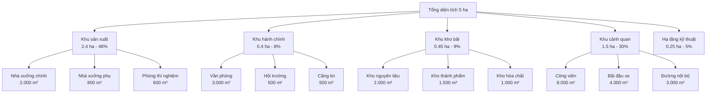

# 17. HIỆU QUẢ SỬ DỤNG ĐẤT VÀ KẾT NỐI HẠ TẦNG

## 17.1 Tổng quan Quy hoạch Đất đai

### 17.1.1 Triết lý sử dụng đất

Khu Phức hợp Sản xuất Công nghệ cao Mekong áp dụng nguyên tắc **"Sử dụng đất hiệu quả - Phát triển bền vững"** với mục tiêu tối ưu hóa mỗi mét vuông đất trong 50 năm hoạt động.

#### Nguyên tắc cốt lõi:
- **Hiệu quả tối đa:** Tận dụng 100% diện tích có thể sử dụng
- **Linh hoạt mở rộng:** Thiết kế cho phép mở rộng theo giai đoạn
- **Xanh tích hợp:** 30% diện tích dành cho cây xanh và cảnh quan
- **Đa chức năng:** Mỗi khu vực có thể phục vụ nhiều mục đích
- **Bền vững môi trường:** Giảm thiểu tác động đến hệ sinh thái

#### Mục tiêu sử dụng đất:
- **Tỷ lệ xây dựng:** 65% (3.25 hecta)
- **Diện tích xanh:** 30% (1.5 hecta)
- **Hạ tầng kỹ thuật:** 5% (0.25 hecta)
- **Hiệu suất sử dụng:** 95% diện tích có giá trị sử dụng

### 17.1.2 Quy hoạch tổng thể

#### Thông tin cơ bản về đất:

**Vị trí và quy mô:**
- **Tổng diện tích:** 5 hecta (50.000 m²)
- **Địa chỉ:** Khu Công nghệ cao, TP. Cần Thơ
- **Tọa độ:** 10°02'N, 105°47'E
- **Độ cao:** +2.5m so với mực nước biển trung bình

**Đặc tính địa chất:**
- **Loại đất:** Phù sa Mekong, dẻo trung bình
- **Sức chịu tải:** 150 kN/m² ở độ sâu 1.5m
- **Mực nước ngầm:** -1.2m so với mặt đất
- **Tính thấm:** 10⁻⁶ cm/s (ít thấm)

#### Phân vùng chức năng:

### 17.1.3 Quy hoạch theo giai đoạn

#### Giai đoạn 1 (2025-2030): Khởi động - 60% diện tích

**Khu vực ưu tiên xây dựng:**
- **Nhà xưởng sản xuất:** 1.200 m² (60% của tổng 2.000 m²)
- **Văn phòng hành chính:** 400 m² (40% của tổng 1.000 m²)
- **Kho nguyên liệu/thành phẩm:** 1.000 m² (50% của tổng 2.000 m²)
- **Hạ tầng cơ bản:** Điện, nước, thoát nước

**Diện tích tạm thời:**
- **Bãi đậu xe tạm:** Đất chưa xây dựng
- **Khu vực tập kết:** Cho vật liệu xây dựng
- **Vườn cây tạm thời:** Trước khi xây dựng giai đoạn sau

#### Giai đoạn 2 (2030-2040): Mở rộng - 85% diện tích

**Bổ sung xây dựng:**
- **Mở rộng nhà xưởng:** Thêm 800 m²
- **Văn phòng mở rộng:** Thêm 600 m²
- **Kho bãi bổ sung:** Thêm 1.000 m²
- **Cơ sở vật chất:** Căng tin, hội trường, phòng gym

#### Giai đoạn 3 (2040-2060): Hoàn thiện - 100% diện tích

**Hoàn thiện tổng thể:**
- **Cảnh quan hoàn chỉnh:** Công viên, hồ nước, vườn thẳng đứng
- **Hạ tầng hiện đại:** Hệ thống thông minh, năng lượng tái tạo
- **Tiện ích cao cấp:** Trung tâm thể thao, khu nghỉ dưỡng

## 17.2 Thiết kế Kiến trúc và Cảnh quan

### 17.2.1 Thiết kế kiến trúc bền vững

#### Nguyên tắc thiết kế:

**Green Building Standards:**
- **LEED Gold certification:** Mục tiêu đạt được năm 2027
- **BREEAM Excellent:** Tiêu chuẩn thiết kế bền vững
- **Vietnam Green Building Council:** Tuân thủ tiêu chuẩn Việt Nam
- **Net Zero Energy:** Mục tiêu năm 2040

**Thiết kế thích ứng khí hậu:**
- **Hướng tối ưu:** Các mặt dài hướng Bắc-Nam
- **Che chắn nắng:** Mái hiên sâu 2m, cây xanh che phủ
- **Thông gió tự nhiên:** Cửa sổ 2 hướng, chiều cao trần 4m
- **Vật liệu phản nhiệt:** Màu sáng, có cách nhiệt

#### Quy hoạch tòa nhà:

**Nhà sản xuất chính (2.000 m²):**
- **Kích thước:** 50m × 40m × 8m cao
- **Cấu trúc:** Khung bê tông cốt thép, mái tôn cách nhiệt
- **Bố trí:** Open space linh hoạt, có thể chia thành zones
- **Thiết bị:** Cần trục 5 tấn, hệ thống thông gió công nghiệp

**Tòa nhà văn phòng (1.000 m²):**
- **Kích thước:** 25m × 40m × 3 tầng
- **Thiết kế:** Mặt tiền kính Low-E, hệ thống màn che tự động
- **Bố trí:** Open office 70%, phòng họp 20%, tiện ích 10%
- **Tiện nghi:** Điều hòa VRV, hệ thống BMS

**Khu kho bãi (2.000 m²):**
- **Kho nguyên liệu:** 800 m², nhiệt độ thường
- **Kho thành phẩm:** 700 m², kiểm soát nhiệt độ
- **Kho hóa chất:** 500 m², thông gió đặc biệt, chống cháy nổ

### 17.2.2 Quy hoạch cảnh quan xanh

#### Thiết kế cảnh quan tổng thể:

**Công viên trung tâm (8.000 m²):**
- **Hồ nước sinh thái:** 1.000 m², xử lý nước mưa
- **Thảm cỏ:** 3.000 m², cỏ lá gạo bản địa
- **Cây xanh:** 4.000 m², ưu tiên cây bản địa
- **Đường dạo bộ:** 2.000 m², vật liệu thấm nước

**Vườn thẳng đứng:**
- **Tường xanh:** 500 m² trên tòa nhà văn phòng
- **Hệ thống tưới:** Tự động, sử dụng nước tái chế
- **Thực vật:** Dương xỉ, cây thuốc, rau ăn lá
- **Hiệu ứng:** Giảm nhiệt độ 2-3°C, lọc không khí

#### Lựa chọn thực vật:

**Cây tán lớn (50 cây):**
- **Bàng lá nhỏ:** 20 cây, bóng mát tốt, chống bão
- **Phượng vĩ:** 15 cây, hoa đẹp, thích ứng khí hậu
- **Sấu:** 15 cây, quả ăn được, có giá trị kinh tế

**Cây bụi và hoa (200 cây):**
- **Hoa giấy:** 50 cây, nhiều màu, ít nước
- **Cúc tần:** 50 cây, hoa trắng, thơm nhẹ
- **Lưỡi hổ:** 100 cây, lọc không khí, ít chăm sóc

**Thảm cỏ và ground cover:**
- **Cỏ lá gạo:** 80% diện tích, thích ứng khô hạn
- **Cỏ lông hũu:** 20% diện tích, chịu ngập úng
- **Cây màn thần:** Che phủ dưới gốc cây

### 17.2.3 Hệ thống giao thông nội bộ

#### Quy hoạch đường giao thông:

**Đường chính (6m rộng):**
- **Chiều dài:** 300m, kết nối cổng chính với các tòa nhà
- **Mặt đường:** Bê tông nhựa, có vỉa hè 1.5m mỗi bên
- **Tải trọng:** 40 tấn, phục vụ xe container
- **Chiếu sáng:** Đèn LED 150W, cách 25m

**Đường nội bộ (4m rộng):**
- **Mạng lưới:** 800m tổng chiều dài
- **Kết nối:** Giữa các khu vực chức năng
- **Mặt đường:** Gạch Concrete block, thấm nước một phần
- **Tải trọng:** 10 tấn, phục vụ xe tải nhỏ

#### Bãi đậu xe:

**Xe ô tô (100 chỗ):**
- **Diện tích:** 2.500 m² (25 m²/chỗ)
- **Phân bố:** 30 chỗ cho khách, 70 chỗ cho nhân viên
- **Thiết kế:** Góc 45°, dễ parking
- **Che chắn:** 50% có mái che solar panel

**Xe máy (300 chỗ):**
- **Diện tích:** 600 m² (2 m²/chỗ)
- **Vị trí:** Gần lối vào chính, có mái che
- **An ninh:** Camera và đèn chiếu sáng
- **Sạc điện:** 50 chỗ sạc cho xe điện

**Xe đạp (50 chỗ):**
- **Diện tích:** 50 m² (1 m²/chỗ)
- **Thiết kế:** Khung sắt cố định
- **Vị trí:** Gần văn phòng, có mái che
- **Khuyến khích:** Chính sách xe đạp xanh

## 17.3 Kết nối Hạ tầng Kỹ thuật

### 17.3.1 Hệ thống cấp điện

#### Nguồn cung cấp điện:

**Điện lưới quốc gia:**
- **Điện áp:** 22kV từ lưới truyền tải
- **Dung lượng:** 2MVA cho toàn dự án
- **Độ tin cậy:** 99.5% uptime
- **Chất lượng:** THD <5%, voltage regulation ±5%

**Trạm biến áp:**
- **Trạm chính:** 1×250kVA, 22kV/0.4kV
- **Vận hành:** 1 hoạt động
- **Vị trí:** Trung tâm phụ tải, 50m từ nhà xưởng
- **Bảo vệ:** Rơle số, chống sét, chống cháy nổ

#### Hệ thống phân phối điện:

**Tủ điện chính (MDB):**
- **Cấu hình:** Double busbar với tie switch
- **Dung lượng:** xxxxA main incomer
- **Outgoing:** 20 feeder × xxxA
- **Monitoring:** Power meter, harmonic analyzer

**Tủ điện phân phối (SDB):**
- **Số lượng:** 8 tủ cho các khu vực
- **Dung lượng:** xxxA mỗi tủ
- **Protection:** MCCB, RCD, SPD
- **Communication:** Modbus RTU cho monitoring

#### Hệ thống backup:

**Máy phát điện dự phòng:**
- **Dung lượng:** 500kVA Cummins diesel
- **Nhiên liệu:** 2.000 lít, 24 giờ hoạt động
- **Chuyển đổi:** ATS tự động <10 giây
- **Phụ tải:** Thiết bị quan trọng, an toàn, PCCC

**UPS hệ thống:**
- **HVAC UPS:** 100kVA cho hệ thống điều hòa
- **IT UPS:** 50kVA cho server, network
- **Safety UPS:** 30kVA cho PCCC, an ninh
- **Battery:** 30 phút backup time

### 17.3.2 Hệ thống cấp thoát nước

#### Cấp nước sạch:

**Nguồn nước:**
- **Nước máy:** 80% từ nhà máy nước thành phố
- **Nước ngầm:** 20% từ giếng khoan dự phòng
- **Chất lượng:** QCVN 01:2018/BYT (nước sinh hoạt)
- **Áp lực:** 3-4 bar tại điểm sử dụng

**Hệ thống phân phối:**
- **Bồn chứa:** 200 m³ nước máy + 100 m³ nước ngầm
- **Máy bơm:** 3 bơm 15kW (2 hoạt động, 1 dự phòng)
- **Đường ống:** HDPE PN10, DN100-200mm
- **Pressure tank:** 2.000 lít duy trì áp lực

#### Hệ thống thoát nước:

**Nước thải sinh hoạt:**
- **Lưu lượng:** 15 m³/ngày
- **Hệ thống:** Gravity flow về bể xử lý
- **Đường ống:** PVC 200-300mm, slope 1-2%
- **Manholes:** 50m spacing, concrete precast

**Nước thải sản xuất:**
- **Thu gom riêng:** Đường ống chuyên dụng
- **Tiền xử lý:** Tách dầu, điều chỉnh pH
- **Giám sát:** Flow meter, pH meter liên tục
- **Kết nối:** Về hệ thống xử lý tập trung

**Thoát nước mưa:**
- **Hệ số runoff:** 0.8 cho mái nhà, 0.6 cho sân bãi
- **Cường độ mưa:** 150mm/h (10 năm 1 lần)
- **Hệ thống:** Separate sewer, không nối với waste water
- **Cống thoát:** Box culvert 1000×800mm

### 17.3.3 Hệ thống thông tin liên lạc

#### Hạ tầng mạng:

**Internet và WAN:**
- **Nhà cung cấp chính:** Viettel Business 500Mbps
- **Backup:** FPT Telecom 300Mbps
- **Công nghệ:** Fiber optic tới building
- **SLA:** 99.9% uptime, 24/7 support

**LAN Infrastructure:**
- **Core switch:** Cisco Catalyst 9500, 48 ports 10GbE
- **Access switch:** Cisco 2960-X, 24 ports 1GbE
- **Cabling:** Cat6A shielded, tới mỗi workspace
- **Wifi:** Cisco Meraki, coverage 100%

#### Hệ thống điện thoại:

**IP Phone System:**
- **PBX:** Cisco CUCM virtual, 200 extensions
- **Handsets:** Cisco IP Phone 8841
- **Features:** Conference, voicemail, mobile app
- **Trunking:** SIP trunks với carrier

**Emergency Communication:**
- **PA System:** Bosch Praesensa, 8 zones
- **Two-way radio:** Motorola DP4400, 20 units
- **Emergency phones:** Outdoor weather-proof
- **Mass notification:** SMS, email integration

#### Hệ thống bảo mật:

**Access Control:**
- **Card readers:** HID multiCLASS tại 15 doors
- **Biometric:** Fingerprint cho khu vực nhạy cảm
- **Integration:** Với CCTV và alarm system
- **Management:** Software-based, role assignment

**CCTV System:**
- **Cameras:** 60 IP cameras, 4MP resolution
- **Coverage:** 100% perimeter, 80% internal
- **Recording:** 30 ngày local, 90 ngày cloud
- **Analytics:** Motion detection, people counting

## 17.4 Hệ thống Giao thông và Logistics

### 17.4.1 Kết nối giao thông bên ngoài

#### Vị trí địa lý thuận lợi:

**Kết nối đường bộ:**
- **Quốc lộ 1A:** Cách 2km, kết nối TP.HCM - Cà Mau
- **Cao tốc TP.HCM - Trung Lương:** Cách 15km
- **Đường tỉnh 918:** Cách 500m, vào trung tâm Cần Thơ
- **Cầu Cần Thơ:** Cách 10km, qua sông Hậu

**Giao thông thủy:**
- **Cảng Cần Thơ:** Cách 12km, container port
- **Bến Ninh Kiều:** Cách 8km, passenger terminal
- **Sông Hậu:** Kết nối vận tải thủy nội địa
- **Kênh Cái Sơn:** Cách 5km, barges nhỏ

**Giao thông hàng không:**
- **Sân bay Cần Thơ:** Cách 25km, 45 phút lái xe
- **Sân bay Tân Sơn Nhất:** 170km, 3 giờ đường bộ
- **Logistics:** Express delivery, cargo handling

#### Phân tích giao thông:

**Lưu lượng giao thông hiện tại:**
- **Đường chính:** 5.000 xe/ngày, peak hour 8:00-9:00
- **Mức độ tắc nghẽn:** LOS C (acceptable)
- **Tốc độ trung bình:** 45 km/h
- **Tăng trưởng:** 5%/năm theo quy hoạch

**Tác động của dự án:**
- **Xe tải (incoming):** 10 xe/ngày, chủ yếu sáng sớm
- **Xe tải (outgoing):** 8 xe/ngày, chiều và tối
- **Xe nhân viên:** 150 xe/ngày, 2 peaks
- **Tổng tác động:** <2% lưu lượng hiện tại

### 17.4.2 Quy hoạch logistics nội bộ

#### Thiết kế logistics flow:

**Receiving Area:**
- **Vị trí:** Phía sau nhà xưởng, tránh giao thông chính
- **Diện tích:** 500 m² sân bãi + 200 m² warehouse
- **Thiết bị:** 2 dock doors, 1 cần trục 3 tấn
- **Access control:** Separate gate cho truck

**Production Flow:**
- **Raw material:** Kho → Khu prep → Production line
- **WIP storage:** Between production stages
- **Finished goods:** Production → QC → Packaging → Shipping
- **Material handling:** Forklift, conveyor, AGV

**Shipping Area:**
- **Vị trí:** Gần kho thành phẩm, separate từ receiving
- **Diện tích:** 400 m² loading bay
- **Thiết bị:** 3 dock doors, hydraulic levelers
- **Staging:** 300 m² cho consolidation

#### Hệ thống kho bãi:

**Kho nguyên liệu (800 m²):**
- **Layout:** Pallet racking 6m high, 1.200 pallet positions
- **Environment:** Controlled temperature 20-25°C
- **Material handling:** 2 forklifts, reach truck
- **Inventory:** 2-week safety stock average

**Kho thành phẩm (700 m²):**
- **Layout:** Drive-in racking, 800 pallet positions
- **Environment:** Standard warehouse conditions
- **Packaging:** Shrink wrap, carton, export packaging
- **Shipping:** FIFO, lot tracking, barcoding

**Kho hóa chất (500 m²):**
- **Design:** Segregated storage theo compatibility
- **Safety:** Explosion-proof electrical, fire suppression
- **Containment:** Secondary containment 110% volume
- **Access:** Restricted, trained personnel only

### 17.4.3 Hệ thống quản lý thông minh

#### Building Management System (BMS):

**Tích hợp hệ thống:**
- **HVAC control:** Schneider EcoStruxure
- **Lighting control:** Lutron Quantum
- **Energy monitoring:** Schneider PowerLogic
- **Security integration:** Lenel OnGuard

**Monitoring và Control:**
- **Central dashboard:** Real-time building status
- **Energy optimization:** Demand response, load shedding
- **Predictive maintenance:** Equipment health monitoring
- **Remote access:** Mobile app, web interface

#### Smart Building Features:

**IoT Sensors:**
- **Occupancy sensors:** 200 units, PIR + ultrasonic
- **Environmental sensors:** CO₂, temperature, humidity
- **Light sensors:** Daylight harvesting
- **Water leak sensors:** Early warning system

**Automation:**
- **Lighting:** Occupancy-based, daylight dimming
- **HVAC:** Demand-controlled ventilation
- **Irrigation:** Weather-based watering
- **Security:** Automatic lock/unlock based on schedule

#### Energy Management:

**Real-time Monitoring:**
- **Main meters:** 3-phase power meters tại MDB
- **Sub-meters:** Individual equipment monitoring
- **Renewable tracking:** Solar PV generation
- **Benchmarking:** kWh/m², kWh/employee, kWh/product

**Energy Optimization:**
- **Peak shaving:** Battery storage during peak hours
- **Load scheduling:** Non-critical loads shift to off-peak
- **Power factor correction:** Maintain >0.95
- **Efficiency tracking:** Continuous improvement targets

## 17.5 Tích hợp Công nghệ Thông minh

### 17.5.1 Hạ tầng IoT và Sensors

#### Mạng lưới cảm biến:

**Environmental Monitoring:**
- **Air quality sensors:** PM2.5, PM10, CO₂, VOCs
- **Noise monitoring:** dB levels tại boundary
- **Weather station:** Wind, rain, temperature, humidity
- **Soil sensors:** Moisture, pH cho landscaping

**Energy và Utilities:**
- **Smart meters:** Electricity, water, gas consumption
- **Power quality:** Harmonics, voltage fluctuations
- **Equipment monitoring:** Vibration, temperature, current
- **Leak detection:** Water pipes, chemical lines

#### Data Collection và Analytics:

**Edge Computing:**
- **Gateway devices:** Industrial IoT gateways
- **Local processing:** Real-time analytics
- **Data filtering:** Reduce bandwidth usage
- **Offline capability:** Local storage và processing

**Cloud Platform:**
- **AWS IoT Core:** Device management, message routing
- **Data lake:** Time-series data storage
- **Machine learning:** Predictive analytics
- **Dashboards:** Real-time visualization

### 17.5.2 Hệ thống tự động hóa

#### Building Automation:

**HVAC Automation:**
- **VAV systems:** Variable air volume control
- **Chiller optimization:** Load-based staging
- **Heat recovery:** Exhaust air heat exchangers
- **Thermal comfort:** Automated temperature control

**Lighting Automation:**
- **Daylight harvesting:** Photosensor-controlled dimming
- **Occupancy sensing:** Motion và ultrasonic sensors
- **Task lighting:** Individual workspace control
- **Emergency lighting:** Automatic testing và reporting

#### Security Automation:

**Access Control:**
- **Badge readers:** HID Prox cards và mobile credentials
- **Biometric integration:** Fingerprint cho high-security areas
- **Video verification:** Camera integration với access events
- **Visitor management:** Self-service kiosks

**Surveillance:**
- **AI analytics:** People counting, behavior analysis
- **Perimeter detection:** Fence line monitoring
- **License plate recognition:** Vehicle tracking
- **Facial recognition:** VIP và blacklist detection

### 17.5.3 Quản lý tài sản số

#### Digital Twin Technology:

**3D Building Model:**
- **BIM integration:** Autodesk Revit, Bentley MicroStation
- **Real-time data:** Sensor feeds vào digital model
- **Simulation:** What-if scenarios
- **Maintenance planning:** Predictive replacement schedules

**Asset Tracking:**
- **RFID tags:** Equipment và inventory tracking
- **QR codes:** Maintenance history, specifications
- **GPS tracking:** Vehicles và mobile equipment
- **Blockchain:** Asset provenance và authenticity

#### Maintenance Management:

**CMMS Integration:**
- **Work orders:** Automated generation based on sensors
- **Spare parts:** Inventory optimization
- **Technician scheduling:** Mobile app dispatch
- **Cost tracking:** Maintenance spend analysis

**Predictive Maintenance:**
- **Vibration analysis:** Rotating equipment health
- **Thermal imaging:** Electrical connections monitoring
- **Oil analysis:** Hydraulic và lubrication systems
- **Performance trending:** Efficiency degradation detection

## 17.6 Đánh giá Hiệu quả và Tối ưu hóa

### 17.6.1 Chỉ số hiệu quả sử dụng đất

#### KPIs về sử dụng đất:

**Hiệu suất diện tích:**
- **Built-up ratio:** 65% (3.25 ha/5 ha)
- **Floor Area Ratio (FAR):** 0.8 (40.000 m²/50.000 m²)
- **Green coverage:** 30% đạt tiêu chuẩn xanh
- **Utilization rate:** 95% diện tích có sử dụng hiệu quả

**Productivity metrics:**
- **Revenue per m²:** 1.020 USD/m²/năm (2030)
- **Employee per m²:** 6 người/1.000 m²
- **Production per m²:** 0.8 sản phẩm/m²/năm
- **Energy per m²:** 150 kWh/m²/năm

#### So sánh benchmark:

**Với khu công nghiệp khác:**
- **FAR trung bình:** 0.6 (Mekong: 0.8)
- **Green ratio:** 15% (Mekong: 30%)
- **Energy intensity:** 200 kWh/m² (Mekong: 150 kWh/m²)
- **Water usage:** 2.5 m³/m² (Mekong: 1.8 m³/m²)

**Với tiêu chuẩn quốc tế:**
- **LEED Gold:** >30% green space (achieved)
- **BREEAM Excellent:** Energy efficiency targets (on track)
- **Living Building:** Net positive energy (target 2040)

### 17.6.2 Tối ưu hóa vận hành

#### Continuous Improvement:

**Kaizen Events:**
- **Space utilization:** Monthly reviews và reallocation
- **Energy efficiency:** Quarterly optimization sessions
- **Process improvement:** Employee suggestion program
- **Technology upgrade:** Annual assessment

**Lean Principles:**
- **5S implementation:** Sort, Set, Shine, Standardize, Sustain
- **Waste elimination:** 7 wastes identification
- **Value stream mapping:** Material và information flow
- **Visual management:** Performance dashboards

#### Performance Monitoring:

**Real-time Dashboards:**
- **Space occupancy:** Heat maps, utilization rates
- **Energy consumption:** Real-time vs. targets
- **Environmental conditions:** Comfort và quality metrics
- **Security status:** Access logs, incident tracking

**Regular Reviews:**
- **Monthly:** Operational metrics review
- **Quarterly:** Strategic goals assessment
- **Annually:** Master plan updates
- **Long-term:** 5-year planning cycles

### 17.6.3 Kế hoạch phát triển tương lai

#### Expansion Planning:

**Phase 4 Considerations (2040-2050):**
- **Vertical expansion:** 2nd floor for office space
- **Underground development:** Parking, utilities, storage
- **Roof utilization:** Solar PV, green roof, terraces
- **Technology integration:** Advanced automation, AI

**Future Technologies:**
- **5G/6G networks:** Ultra-low latency applications
- **Edge AI:** Real-time decision making
- **Autonomous systems:** Self-driving vehicles, drones
- **Virtual reality:** Remote collaboration, training

#### Sustainability Goals:

**2030 Targets:**
- **Carbon neutral:** Net zero operational emissions
- **Water positive:** More water returned than consumed
- **Waste elimination:** Zero waste to landfill
- **Biodiversity net positive:** Ecosystem enhancement

**2040 Vision:**
- **Regenerative design:** Building improves environment
- **Circular economy:** Closed-loop material flows
- **Community integration:** Shared facilities và services
- **Climate resilience:** Adaptation to climate change

---

**Kết luận:**

Quy hoạch sử dụng đất và kết nối hạ tầng được thiết kế để:

1. **Tối ưu hóa không gian:** Sử dụng hiệu quả mỗi mét vuông
2. **Tích hợp thông minh:** Công nghệ hỗ trợ vận hành
3. **Bền vững môi trường:** 30% diện tích xanh, tiết kiệm năng lượng
4. **Linh hoạt mở rộng:** Phát triển theo từng giai đoạn
5. **Kết nối toàn diện:** Hạ tầng hiện đại và đáng tin cậy

**Phụ lục:**

**A. Bản vẽ quy hoạch tổng thể**
**B. Sơ đồ hạ tầng kỹ thuật**
**C. Thiết kế cảnh quan chi tiết**
**D. Specifications kỹ thuật các hệ thống**
**E. Kế hoạch triển khai từng giai đoạn** 