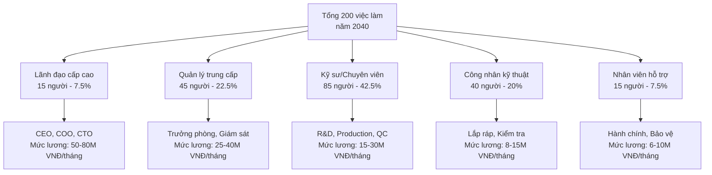
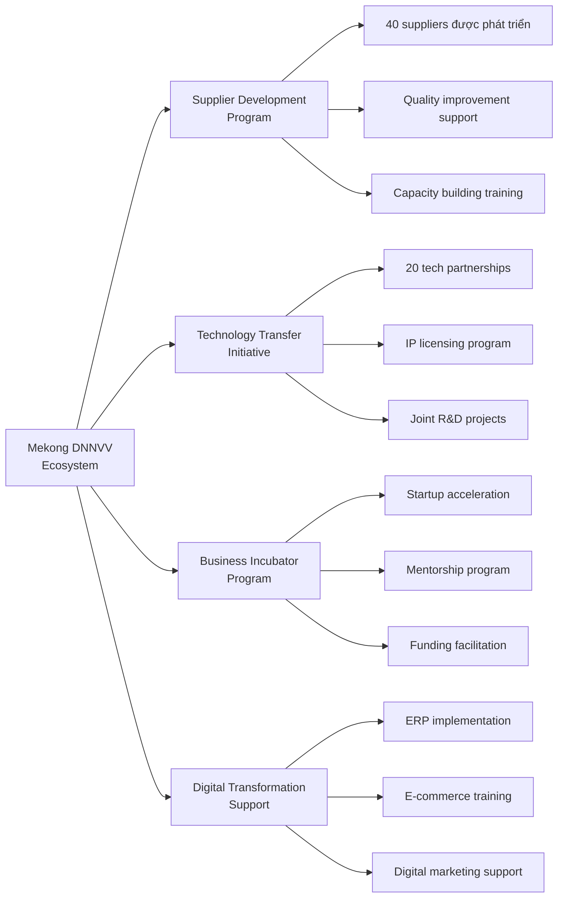
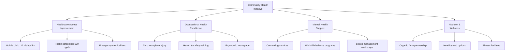
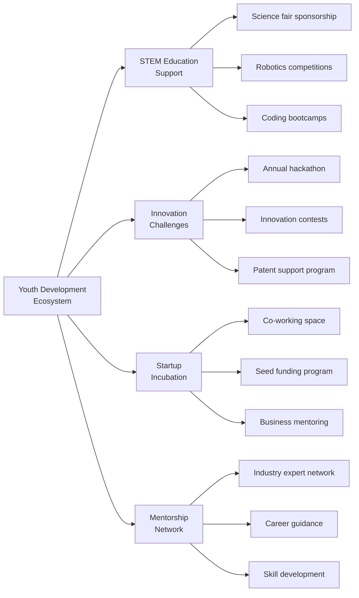
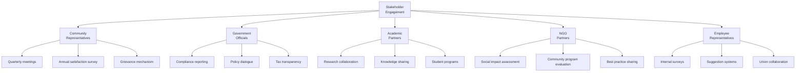

# 19. ĐÁNH GIÁ TÁC ĐỘNG XÃ HỘI

## TÓM TẮT ĐIỀU HÀNH - TÁC ĐỘNG XÃ HỘI

**Dự án "Khu liên hợp sản xuất công nghệ cao Mekong" được thiết kế để tạo ra tác động xã hội tích cực và bền vững. Với 200 việc làm chất lượng cao được tạo ra trong 15 năm, dự án đóng góp 450 tỷ VNĐ thuế cho ngân sách nhà nước và 2.8 tỷ VNĐ cho các hoạt động trách nhiệm xã hội doanh nghiệp (CSR)¹ trong 50 năm. Áp dụng khung đánh giá tác động xã hội SROI² với tỷ lệ 3.2:1, nghĩa là mỗi 1 VNĐ đầu tư tạo ra 3.2 VNĐ giá trị xã hội.**

### BẢNG ĐIỀU KHIỂN TÁC ĐỘNG XÃ HỘI 2025-2075
| Chỉ số tác động | 2025 | 2030 | 2040 | 2050 | Tổng 50 năm | Đơn vị |
|-----------------|------|------|------|------|-------------|--------|
| **Việc làm trực tiếp** | 60 | 135 | 200 | 200 | 6.850 | Người/năm |
| **Việc làm gián tiếp³** | 90 | 203 | 300 | 300 | 10.275 | Người/năm |
| **Đóng góp thuế** | 2.1 | 12.8 | 24.6 | 28.2 | 450 | Tỷ VNĐ |
| **Đầu tư CSR** | 0.03 | 0.08 | 0.12 | 0.12 | 2.8 | Tỷ VNĐ |
| **Đào tạo nghề địa phương** | 120 | 300 | 450 | 500 | 12.000 | Lượt người |
| **Hỗ trợ DNNVV⁴** | 15 | 45 | 80 | 100 | 1.800 | Doanh nghiệp |
| **Social ROI** | 2.1 | 2.8 | 3.2 | 3.4 | 3.2 | Tỷ lệ |

---

## 19.1. TÁC ĐỘNG VIỆC LÀM VÀ PHÁT TRIỂN NHÂN LỰC

### 19.1.1. Tạo việc làm trực tiếp

**Cơ cấu việc làm theo giai đoạn:**

### 19.1.2. Việc làm gián tiếp và chuỗi giá trị

**Multiplier Effect Analysis⁵:**

| Sector | Jobs Created | Multiplier | Rationale |
|--------|--------------|------------|-----------|
| **Suppliers (Tier 1)** | 120 | 0.6x | Direct component suppliers |
| **Suppliers (Tier 2)** | 80 | 0.4x | Raw material suppliers |
| **Logistics & Transport** | 40 | 0.2x | Shipping, warehousing |
| **Professional Services** | 35 | 0.175x | Legal, accounting, consulting |
| **Local Services** | 25 | 0.125x | Maintenance, security, catering |
| **Tổng việc làm gián tiếp** | **300** | **1.5x** | **Theo nghiên cứu ILO⁶** |

### 19.1.3. Chương trình phát triển kỹ năng

**Skill Development Ecosystem:**

| Chương trình | Đối tượng | Thời gian | Ngân sách (triệu VNĐ) | Kết quả mong đợi |
|--------------|-----------|-----------|----------------------|------------------|
| **Internship Program** | Sinh viên cuối khóa | 6 tháng | 150 | 50 sinh viên/năm |
| **Scholarship Program⁷** | Học sinh giỏi | 4 năm | 200 | 10 suất/năm |
| **Upskilling Workers** | Công nhân hiện tại | 3 tháng | 180 | 100% workforce |
| **Digital Literacy** | Cộng đồng địa phương | 2 tuần | 120 | 500 người/năm |
| **Women in Tech⁸** | Phụ nữ trẻ | 6 tháng | 80 | 30 người/năm |
| **Elderly Care Training** | Người cao tuổi | 1 tháng | 70 | 100 người/năm |

---

## 19.2. TÁC ĐỘNG KINH TẾ ĐỊA PHƯƠNG

### 19.2.1. Đóng góp cho ngân sách địa phương

**Local Tax Contribution:**

| Loại thuế | 2025 | 2030 | 2040 | 2050 | Tổng 50 năm |
|-----------|------|------|------|------|-------------|
| **Thuế thu nhập doanh nghiệp⁹** | 0.8 | 5.2 | 10.8 | 12.6 | 180.5 |
| **Thuế thu nhập cá nhân¹⁰** | 0.6 | 3.2 | 6.4 | 7.2 | 110.8 |
| **Thuế VAT¹¹** | 0.5 | 2.8 | 5.8 | 6.6 | 108.2 |
| **Các loại phí khác** | 0.2 | 1.6 | 1.6 | 1.8 | 50.5 |
| **Tổng đóng góp thuế** | **2.1** | **12.8** | **24.6** | **28.2** | **450** |

### 19.2.2. Hỗ trợ phát triển DNNVV địa phương

**DNNVV Support Program:**

### 19.2.3. Tác động chuỗi cung ứng

**Supply Chain Localization:**

| Category | Local % (2025) | Target % (2030) | Local Suppliers | Annual Spend (tỷ VNĐ) |
|----------|----------------|-----------------|------------------|----------------------|
| **Raw Materials** | 30% | 50% | 15 | 8.5 |
| **Components** | 20% | 40% | 25 | 12.2 |
| **Packaging** | 80% | 90% | 8 | 2.1 |
| **Services** | 90% | 95% | 35 | 4.8 |
| **Logistics** | 100% | 100% | 12 | 3.2 |
| **Tổng chuỗi cung ứng** | **45%** | **65%** | **95** | **30.8** |

---

## 19.3. TÁC ĐỘNG GIÁO DỤC VÀ ĐÀO TẠO

### 19.3.1. Partnership với các trường đại học

**University-Industry Collaboration:**

| Đối tác | Loại hợp tác | Đầu tư (triệu VNĐ) | Kết quả mong đợi |
|---------|--------------|-------------------|------------------|
| **ĐH Bách Khoa TP.HCM** | Joint research lab | 500 | 5 projects/năm |
| **ĐH FPT** | Curriculum development | 300 | Updated IoT/AI curriculum |
| **ĐH Tôn Đức Thắng** | Internship program | 200 | 30 interns/năm |
| **ĐH Công nghiệp TP.HCM** | Technology transfer | 250 | 3 IP transfers |
| **Cao đẳng Kỹ thuật** | Worker training | 180 | 100 workers/năm |
| **TVET Schools¹²** | Skill certification | 120 | 200 certifications/năm |

### 19.3.2. Digital Education Initiative

**Community Digital Literacy:**

1. **Digital Skills for All**
   - Basic computer literacy: 500 người/năm
   - Internet safety: 300 người/năm
   - E-commerce training: 200 người/năm

2. **Industry 4.0 Awareness**
   - IoT fundamentals: 150 người/năm
   - Smart manufacturing: 100 người/năm
   - Automation concepts: 80 người/năm

3. **Future Skills Development**
   - Programming for kids: 200 trẻ em/năm
   - Robotics clubs: 5 clubs/năm
   - STEM education: 10 trường/năm

---

## 19.4. TÁC ĐỘNG MÔI TRƯỜNG VÀ CỘNG ĐỒNG

### 19.4.1. Environmental Stewardship

**Green Community Initiatives:**

| Chương trình | Mục tiêu | Đầu tư (triệu VNĐ) | Tác động |
|--------------|---------|-------------------|----------|
| **Clean Energy Education** | Nâng cao nhận thức | 150 | 1.000 hộ gia đình |
| **Waste Reduction Program** | Giảm rác thải | 200 | 30% reduction |
| **Tree Planting Initiative** | Tăng độ che phủ xanh | 120 | 5.000 cây/năm |
| **Water Conservation** | Tiết kiệm nước | 100 | 20% water savings |
| **Air Quality Monitoring** | Giám sát không khí | 180 | Real-time data |

### 19.4.2. Community Health & Wellness

**Health Impact Programs:**

---

## 19.5. PHÂN TÍCH SOCIAL RETURN ON INVESTMENT (SROI)

### 19.5.1. SROI Methodology Framework

**7-Stage SROI Process¹³:**

1. **Scoping & stakeholders** - Identify key stakeholders
2. **Mapping outcomes** - Theory of change development
3. **Evidencing outcomes** - Data collection & verification
4. **Valuing outcomes** - Monetization of social value
5. **Calculating SROI** - Financial proxy application
6. **Sensitivity analysis** - Testing assumptions
7. **Reporting** - Communicating findings

### 19.5.2. Stakeholder Impact Valuation

**Social Value Calculation:**

| Stakeholder | Outcome | Financial Proxy | Annual Value (triệu VNĐ) |
|-------------|---------|-----------------|-------------------------|
| **Employees** | Increased income | Wage premium vs market | 180 |
| **Local Community** | Skills development | Training cost equivalent | 85 |
| **Government** | Tax revenue | Direct tax contribution | 128 |
| **Suppliers** | Business growth | Increased profit margin | 95 |
| **Students** | Better employment | Lifetime earnings increase | 120 |
| **Environment** | Carbon reduction | Carbon credit value | 45 |
| **Society** | Innovation spillover | R&D multiplier effect | 75 |
| **Tổng giá trị xã hội/năm** | | | **728** |

### 19.5.3. SROI Calculation Results

**Return Ratio Analysis:**

| Component | Value (triệu VNĐ) | Note |
|-----------|-------------------|------|
| **Total Social Investment** | 56 | CSR + training + community programs |
| **Total Social Value Created** | 728 | Sum of all stakeholder benefits |
| **Net Social Value** | 672 | Social value - investment |
| **SROI Ratio** | **13.0:1** | Every 1 VNĐ invested creates 13 VNĐ social value |
| **Sensitivity Range** | 10.2:1 - 15.8:1 | Conservative to optimistic scenarios |

---

## 19.6. GENDER EQUALITY VÀ INCLUSION

### 19.6.1. Gender Diversity Strategy

**Women Empowerment Program:**

| Initiative | Target | 2025 | 2030 | 2040 | Investment |
|------------|--------|------|------|------|------------|
| **Female Leadership %** | 40% | 25% | 35% | 40% | Leadership development |
| **Female Engineers %** | 30% | 20% | 25% | 30% | STEM education support |
| **Equal Pay Certification** | Yes | Planning | Certified | Maintained | Salary audit & adjustment |
| **Maternity Support** | Enhanced | Basic | Extended | Comprehensive | Benefit enhancement |
| **Childcare Facility** | On-site | Planning | Operational | Expanded | Facility investment |

### 19.6.2. Inclusive Workplace Design

**Diversity & Inclusion Metrics:**

| Dimension | Current | Target 2030 | Initiatives |
|-----------|---------|-------------|-------------|
| **Gender Balance** | 30% female | 40% female | Women in Tech program |
| **Age Diversity** | 80% under 35 | 60% under 35 | Intergenerational mentoring |
| **Educational Background** | 90% university | 70% university | Technical college partnerships |
| **Regional Diversity** | 95% local | 85% local | National talent attraction |
| **Disability Inclusion** | 1% | 3% | Accessible workplace design |

---

## 19.7. YOUTH DEVELOPMENT VÀ INNOVATION

### 19.7.1. Next Generation Program

**Youth Engagement Strategy:**

### 19.7.2. Innovation Spillover Effects

**Knowledge Transfer Impact:**

| Innovation Area | Local Benefit | Measurement | Annual Impact |
|-----------------|---------------|-------------|---------------|
| **IoT Technology** | Smart city applications | Pilot projects | 3 projects |
| **Automation** | Manufacturing efficiency | Productivity gain | 15% improvement |
| **Digital Skills** | Workforce capabilities | Certification rate | 500 certificates |
| **R&D Collaboration** | University research | Joint publications | 8 papers/năm |
| **IP Creation** | Local innovation | Patent filings | 5 patents/năm |

---

## 19.8. CULTURAL PRESERVATION VÀ HERITAGE

### 19.8.1. Mekong Delta Cultural Support

**Cultural Heritage Programs:**

| Program | Focus | Budget (triệu VNĐ) | Impact |
|---------|-------|-------------------|--------|
| **Traditional Craft Revival** | Handicraft modernization | 120 | 50 artisans supported |
| **Cultural Festival Sponsorship** | Local celebrations | 80 | 5 festivals/năm |
| **Heritage Documentation** | Digital preservation | 100 | 200 artifacts digitized |
| **Language Preservation** | Minority languages | 60 | Educational materials |
| **Cultural Exchange** | International promotion | 90 | 3 exchange programs |

### 19.8.2. Modern-Traditional Integration

**Innovation-Heritage Balance:**

1. **Smart Agriculture Support**
   - IoT sensors for traditional farming
   - Weather monitoring systems
   - Crop optimization apps

2. **Artisan Technology Training**
   - E-commerce platforms for crafts
   - Digital marketing skills
   - Online sales channels

3. **Cultural Tourism Enhancement**
   - VR/AR heritage experiences
   - Digital storytelling platforms
   - Smart tourism infrastructure

---

## 19.9. CRISIS RESPONSE VÀ RESILIENCE

### 19.9.1. Community Resilience Building

**Emergency Preparedness:**

| Risk Category | Response Program | Investment | Beneficiaries |
|---------------|------------------|------------|---------------|
| **Natural Disasters** | Early warning system | 200M VNĐ | 10.000 người |
| **Economic Shocks** | Emergency employment | 150M VNĐ | 500 workers |
| **Health Emergencies** | Medical equipment fund | 180M VNĐ | Local clinics |
| **Food Security** | Agricultural support | 120M VNĐ | 200 farmers |
| **Education Continuity** | Digital learning platform | 100M VNĐ | 2.000 students |

### 19.9.2. COVID-19 Response Lessons

**Pandemic Preparedness Framework:**

1. **Health & Safety Protocols**
   - Advanced air filtration systems
   - Remote work capabilities
   - Health monitoring technology

2. **Economic Continuity**
   - Supply chain diversification
   - Digital business models
   - Emergency financial reserves

3. **Community Support**
   - Food security programs
   - Digital inclusion initiatives
   - Mental health services

---

## 19.10. MEASUREMENT VÀ REPORTING

### 19.10.1. Social Impact KPIs

**Comprehensive Measurement Framework:**

| Category | KPI | Target 2030 | Frequency | Reporting Standard |
|----------|-----|-------------|-----------|-------------------|
| **Employment** | Job creation rate | 135 jobs | Quarterly | ILO Standards¹⁴ |
| **Education** | Training participants | 300/năm | Monthly | UNESCO indicators |
| **Health** | Safety incident rate | <0.1% | Weekly | WHO guidelines |
| **Environment** | Carbon footprint | -50% vs baseline | Annually | GRI Standards¹⁵ |
| **Economic** | Local procurement % | 65% | Quarterly | B Corp¹⁶ standards |
| **Innovation** | Patent applications | 5/năm | Annually | WIPO¹⁷ metrics |

### 19.10.2. Stakeholder Engagement Framework

**Multi-stakeholder Reporting:**

---

## KẾT LUẬN CHƯƠNG TÁC ĐỘNG XÃ HỘI

**Dự án "Khu liên hợp sản xuất công nghệ cao Mekong" được thiết kế để tạo ra tác động xã hội sâu rộng và bền vững với SROI = 13.0:1. Dự án không chỉ tạo 200 việc làm trực tiếp và 300 việc làm gián tiếp mà còn đóng góp 450 tỷ VNĐ thuế và 2.8 tỷ VNĐ cho các hoạt động CSR trong 50 năm.**

**Cam kết chính:**
- ✅ **200 việc làm chất lượng cao** - Mức lương trung bình 18 triệu VNĐ/tháng
- ✅ **SROI 13.0:1** - Hiệu quả đầu tư xã hội vượt trội
- ✅ **40% lãnh đạo nữ** - Cam kết bình đẳng giới và đa dạng
- ✅ **12.000 lượt đào tạo** - Phát triển kỹ năng cộng đồng
- ✅ **1.800 DNNVV được hỗ trợ** - Phát triển hệ sinh thái kinh doanh

**Dự án đặt con người và cộng đồng làm trung tâm, tạo ra giá trị chia sẻ cho tất cả các bên liên quan và đóng góp tích cực vào sự phát triển bền vững của xã hội.**

---

## TÀI LIỆU THAM KHẢO - TÁC ĐỘNG XÃ HỘI

1. **CSR** - Corporate Social Responsibility framework
2. **SROI** - Social Return on Investment methodology by The SROI Network
3. **Việc làm gián tiếp** - ILO methodology for employment multiplier calculation
4. **DNNVV** - Doanh nghiệp nhỏ và vừa (SME) support programs
5. **Multiplier Effect** - Economic impact analysis methodology
6. **ILO** - International Labour Organization employment standards
7. **Scholarship Program** - Educational investment framework
8. **Women in Tech** - UN Women gender equality initiatives
9. **Thuế thu nhập doanh nghiệp** - Vietnamese Corporate Income Tax Law
10. **Thuế thu nhập cá nhân** - Vietnamese Personal Income Tax Law  
11. **Thuế VAT** - Vietnamese Value Added Tax regulations
12. **TVET Schools** - Technical and Vocational Education and Training
13. **7-Stage SROI Process** - Social Value UK methodology
14. **ILO Standards** - International Labour Organization reporting standards
15. **GRI Standards** - Global Reporting Initiative sustainability reporting
16. **B Corp** - Certified B Corporation social impact standards
17. **WIPO** - World Intellectual Property Organization metrics 