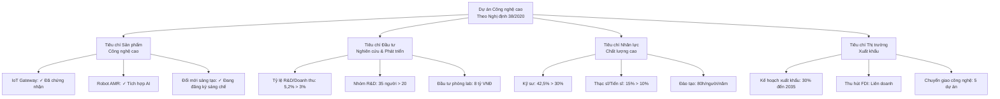
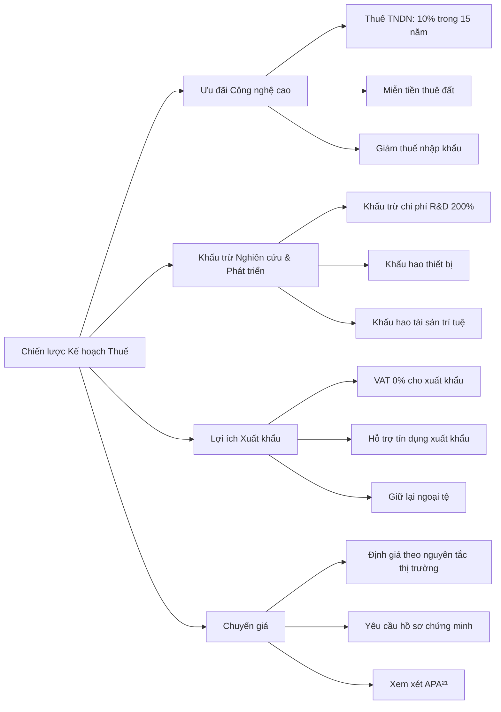
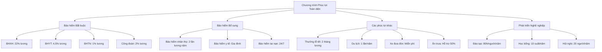
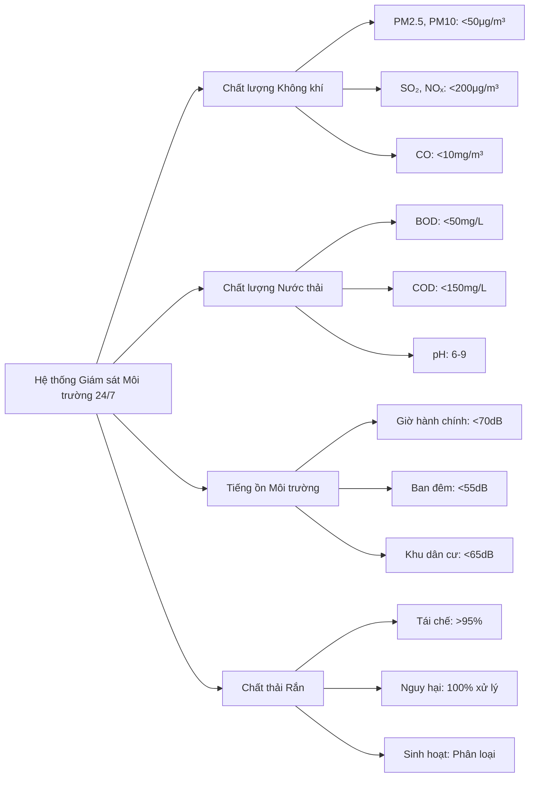

# 21. TUÂN THỦ PHÁP LÝ VÀ YÊU CẦU CẤP PHÉP

## 21.1 Tổng quan Khung Pháp lý

### 21.1.1 Hệ thống pháp luật áp dụng

Khu Phức hợp Sản xuất Công nghệ cao Mekong hoạt động trong môi trường pháp lý **"Đa tầng và tích hợp"** với sự tuân thủ đầy đủ các quy định từ trung ương đến địa phương.

#### Khung pháp lý chính:
- **Hiến pháp 2013:** Quyền và nghĩa vụ của doanh nghiệp
- **Luật Doanh nghiệp 2020:** Thành lập và hoạt động doanh nghiệp
- **Luật Đầu tư 2020:** Ưu đãi đầu tư và cam kết nhà đầu tư
- **Luật Công nghệ cao 2008:** Khuyến khích phát triển công nghệ cao
- **Luật Sở hữu trí tuệ 2005:** Bảo hộ quyền sở hữu trí tuệ

#### Văn bản dưới luật:
- **Nghị định 31/2021/NĐ-CP:** Về đầu tư theo phương thức đối tác công tư
- **Nghị định 52/2021/NĐ-CP:** Về cơ chế, chính sách đặc thù phát triển TP Cần Thơ
- **Thông tư 03/2021/TT-BKHCN:** Về công nghệ cao và ưu tiên phát triển
- **Quyết định 844/QĐ-TTg:** Về chiến lược phát triển công nghiệp hỗ trợ

### 21.1.2 Nguyên tắc tuân thủ

#### Cam kết tuân thủ:
- **Không khoan nhượng:** Không chấp nhận bất kỳ vi phạm pháp luật nào
- **Chủ động tuân thủ:** Chủ động nghiên cứu và áp dụng các quy định mới
- **Giám sát liên tục:** Theo dõi thường xuyên các thay đổi của pháp luật
- **Hỗ trợ chuyên nghiệp:** Sử dụng dịch vụ tư vấn pháp lý chuyên nghiệp
- **Báo cáo minh bạch:** Báo cáo đầy đủ, chính xác cho cơ quan quản lý

#### Khung tuân thủ:
- **Rà soát pháp lý:** Rà soát pháp lý toàn diện trước khi hoạt động
- **Lịch tuân thủ:** Lập lịch tuân thủ các nghĩa vụ pháp lý
- **Kiểm tra nội bộ:** Kiểm tra nội bộ việc tuân thủ pháp luật
- **Chương trình đào tạo:** Đào tạo tuân thủ cho toàn bộ nhân viên
- **Lưu trữ hồ sơ:** Lưu trữ đầy đủ hồ sơ pháp lý

## 21.2 Thủ tục Thành lập và Cấp phép Đầu tư

### 21.2.1 Thành lập doanh nghiệp

#### Loại hình doanh nghiệp:

**Công ty TNHH hai thành viên trở lên:**
- **Lý do lựa chọn:** Phù hợp với cơ cấu vốn đa quốc gia
- **Vốn điều lệ:** 120 tỷ VNĐ (tương đương 5 triệu USD)
- **Cổ đông:** Nhà đầu tư chính 60%, đối tác chiến lược 25%, quỹ đầu tư 15%
- **Quản trị:** Hội đồng thành viên, Ban Tổng giám đốc

#### Quy trình thành lập doanh nghiệp:

**Bước 1: Chuẩn bị hồ sơ (2 tuần)**
- **Tên doanh nghiệp:** Đăng ký bảo lưu tên "Công ty TNHH Công nghệ cao Mekong"
- **Điều lệ công ty:** Soạn thảo theo mẫu và đặc thù của dự án
- **Hợp đồng thành lập:** Giữa các thành viên góp vốn
- **Giấy chứng nhận đầu tư:** Nếu có nhà đầu tư nước ngoài

**Bước 2: Nộp hồ sơ và tiếp nhận (1 tuần)**
- **Cơ quan tiếp nhận:** Phòng Đăng ký kinh doanh - Sở Kế hoạch Đầu tư Cần Thơ
- **Hình thức nộp:** Trực tiếp hoặc trực tuyến qua hệ thống
- **Phí đăng ký:** 1.500.000 VNĐ
- **Thời gian xử lý:** 15 ngày làm việc

**Bước 3: Hoàn tất thủ tục (2 tuần)**
- **Giấy chứng nhận đăng ký doanh nghiệp:** Nhận từ Sở KH&ĐT
- **Con dấu:** Đăng ký và khắc con dấu
- **Tài khoản ngân hàng:** Mở tài khoản doanh nghiệp
- **Mã số thuế:** Đăng ký với Cục Thuế Cần Thơ

#### Hồ sơ thành lập chi tiết:

**Đối với thành viên trong nước:**
- **Giấy chứng minh nhân dân/Căn cước công dân:** Bản sao có chứng thực
- **Sơ yếu lý lịch:** Theo mẫu quy định
- **Giấy khám sức khỏe:** Chứng nhận đủ sức khỏe
- **Cam kết góp vốn:** Xác nhận số vốn và hình thức góp

**Đối với thành viên nước ngoài:**
- **Passport:** Bản sao có chứng thực lãnh sự
- **Giấy chứng nhận tư cách pháp nhân:** Của tổ chức nước ngoài
- **Báo cáo tài chính:** 2 năm gần nhất đã kiểm toán
- **Giấy chứng nhận đầu tư:** Từ Bộ Kế hoạch Đầu tư (nếu cần)

### 21.2.2 Giấy phép đầu tư

#### Thẩm quyền cấp phép:

**Ủy ban nhân dân tỉnh Cần Thơ:**
- **Vốn đầu tư:** <1.500 tỷ VNĐ
- **Lĩnh vực:** Công nghệ cao được khuyến khích
- **Thời gian xử lý:** 45 ngày làm việc (có thể rút ngắn xuống 25 ngày)
- **Hiệu lực:** 50 năm theo đề nghị

#### Hồ sơ đề nghị cấp Giấy phép đầu tư:

**Các văn bản chính:**
1. **Đơn đề nghị cấp Giấy phép đầu tư:** Theo mẫu 01/ĐT
2. **Dự án đầu tư:** Báo cáo nghiên cứu khả thi chi tiết
3. **Bản sao Điều lệ:** Của nhà đầu tư là tổ chức
4. **Báo cáo tài chính:** 2 năm gần nhất của nhà đầu tư
5. **Giấy chứng nhận đăng ký doanh nghiệp:** Nếu đã thành lập

**Tài liệu kỹ thuật:**
- **Báo cáo đánh giá tác động môi trường:** Theo Thông tư 01/2021/TT-MONRE
- **Báo cáo an toàn lao động:** Theo Nghị định 44/2016/NĐ-CP
- **Phương án phòng cháy chữa cháy:** Theo Nghị định 136/2020/NĐ-CP
- **Giải trình về sử dụng đất:** Theo quy hoạch được duyệt

#### Quy trình xét duyệt:

**Giai đoạn 1: Tiếp nhận và thẩm định sơ bộ (7 ngày)**
- Kiểm tra tính đầy đủ và hợp lệ của hồ sơ
- Thông báo bổ sung (nếu có) trong vòng 7 ngày
- Chuyển hồ sơ cho các phòng ban chuyên môn

**Giai đoạn 2: Thẩm định chuyên môn (25 ngày)**
- **Phòng KH&ĐT:** Thẩm định tính khả thi và hiệu quả
- **Phòng TN&MT:** Đánh giá tác động môi trường
- **Phòng LĐ-TB&XH:** Đánh giá an toàn lao động
- **Phòng Xây dựng:** Thẩm định hạ tầng kỹ thuật

**Giai đoạn 3: Tổng hợp và quyết định (13 ngày)**
- Tổng hợp ý kiến các phòng ban
- Trình UBND tỉnh xem xét, quyết định
- Cấp Giấy phép đầu tư hoặc thông báo từ chối (có lý do)

### 21.2.3 Các giấy phép chuyên ngành

#### Giấy phép môi trường:

**Báo cáo đánh giá tác động môi trường (ĐTM):**
- **Cơ quan cấp phép:** Sở Tài nguyên và Môi trường Cần Thơ
- **Thời gian xử lý:** 60 ngày làm việc
- **Hiệu lực:** Theo thời gian thực hiện dự án
- **Phí thẩm định:** 50.000.000 VNĐ

**Nội dung chính báo cáo ĐTM:**
- **Mô tả dự án:** Quy mô, công nghệ, vị trí
- **Hiện trạng môi trường:** Đất, nước, không khí, sinh thái
- **Dự báo tác động:** Tích cực và tiêu cực
- **Biện pháp giảm thiểu:** Chi tiết và khả thi
- **Chương trình quan trắc:** Giám sát chất lượng môi trường

#### Giấy phép xây dựng:

**Giấy phép xây dựng công trình:**
- **Cơ quan cấp phép:** Sở Xây dựng Cần Thơ
- **Thời gian xử lý:** 20 ngày làm việc
- **Hiệu lực:** 24 tháng (có thể gia hạn)
- **Phí cấp phép:** 0.05% tổng mức đầu tư xây dựng

**Hồ sơ xin cấp giấy phép xây dựng:**
- **Đơn đề nghị:** Theo mẫu quy định
- **Quyết định phê duyệt dự án:** Của cơ quan có thẩm quyền
- **Hồ sơ thiết kế cơ sở:** Đã được phê duyệt
- **Giấy chứng nhận quyền sử dụng đất:** Hoặc hợp đồng thuê đất

#### Giấy phép an toàn lao động:

**Thẩm định về an toàn lao động:**
- **Cơ quan thẩm định:** Sở Lao động - Thương binh và Xã hội
- **Thời gian xử lý:** 30 ngày làm việc
- **Hiệu lực:** Theo thời gian hoạt động dự án
- **Phí thẩm định:** 20.000.000 VNĐ

## 21.3 Tuân thủ Pháp luật Lao động

### 21.3.1 Hợp đồng lao động và chế độ làm việc

#### Các loại hợp đồng lao động:

**Hợp đồng lao động không xác định thời hạn:**
- **Đối tượng:** Nhân viên chính thức, vị trí quan trọng
- **Tỷ lệ:** 80% tổng số lao động
- **Ưu điểm:** Ổn định, gắn bó lâu dài
- **Nghĩa vụ:** Đầy đủ quyền lợi theo quy định

**Hợp đồng lao động xác định thời hạn:**
- **Đối tượng:** Vị trí thay thế, dự án có thời hạn
- **Thời hạn:** 12-36 tháng
- **Tỷ lệ:** 15% tổng số lao động
- **Điều kiện gia hạn:** Tối đa 1 lần

**Hợp đồng lao động thời vụ:**
- **Đối tượng:** Lao động mùa vụ, tăng ca đột xuất
- **Thời hạn:** <12 tháng
- **Tỷ lệ:** 5% tổng số lao động

#### Thời giờ làm việc và nghỉ ngơi:

**Giờ làm việc bình thường:**
- **Thời gian:** 8 giờ/ngày, 48 giờ/tuần
- **Lịch làm việc:** Thứ 2 - Thứ 7, 7:30-16:30
- **Giờ nghỉ trưa:** 11:30-12:30
- **Nghỉ cuối tuần:** Chủ nhật và một ngày khác trong tuần (luân phiên)

**Làm thêm giờ:**
- **Giới hạn:** 12 giờ/ngày, 40 giờ/tháng, 200 giờ/năm
- **Phụ cấp:** 150% ngày thường, 200% nghỉ lễ, 300% Chủ nhật
- **Thỏa thuận:** Cần có sự đồng ý của người lao động
- **Trường hợp đặc biệt:** Có thể vượt giới hạn theo quy định

#### Nghỉ phép và các chế độ khác:

**Nghỉ phép năm:**
- **Cơ bản:** 12 ngày/năm
- **Thâm niên:** +1 ngày cho mỗi 5 năm làm việc
- **Điều kiện khí hậu:** +1 ngày (khu vực miền Nam)
- **Tuổi tác:** +1 ngày nếu ≥55 tuổi (nam), ≥50 tuổi (nữ)

**Các loại nghỉ khác:**
- **Nghỉ lễ tết:** 10 ngày theo lịch nhà nước + 1 ngày Tết Dương lịch
- **Nghỉ thai sản:** 6 tháng đối với lao động nữ
- **Nghỉ ốm đau:** Theo quy định bảo hiểm y tế
- **Nghỉ việc riêng:** 3 ngày có lương/năm

### 21.3.2 Lương và chế độ đãi ngộ

#### Cơ cấu tiền lương:

**Lương cơ bản:**
- **Nguyên tắc:** Không thấp hơn mức lương tối thiểu vùng
- **Mức lương tối thiểu:** 4.420.000 VNĐ/tháng (vùng I - Cần Thơ)
- **Thang bảng lương:** 15 bậc × 5 mức/bậc
- **Điều chỉnh:** Hàng năm theo CPI và hiệu quả kinh doanh

**Phụ cấp và thưởng:**
- **Phụ cấp chức vụ:** 20-50% lương cơ bản
- **Phụ cấp độc hại:** 5-10% cho vị trí có yếu tố nguy hiểm
- **Thưởng hiệu suất:** 10-30% lương cơ bản/tháng
- **Thưởng cuối năm:** 1-3 tháng lương tùy hiệu quả

#### Các khoản đóng góp bắt buộc:

**Bảo hiểm xã hội:**
- **Tỷ lệ đóng:** 17.5% (DN: 10.5%, NLĐ: 7%)
- **Mức lương đóng:** Theo lương đóng BHXH thực tế
- **Quyền lợi:** Hưu trí, ốm đau, tai nạn lao động, thất nghiệp

**Bảo hiểm y tế:**
- **Tỷ lệ đóng:** 4.5% (DN: 3%, NLĐ: 1.5%)
- **Phạm vi:** Khám chữa bệnh theo quy định
- **Thẻ BHYT:** Cấp cho 100% người lao động

**Bảo hiểm thất nghiệp:**
- **Tỷ lệ đóng:** 2% (DN: 1%, NLĐ: 1%)
- **Điều kiện:** Hợp đồng ≥3 tháng
- **Quyền lợi:** Trợ cấp thất nghiệp, đào tạo nghề

### 21.3.3 An toàn và vệ sinh lao động

#### Hệ thống quản lý an toàn lao động:

**Tổ chức bộ máy:**
- **Cán bộ an toàn lao động:** 1 người chuyên trách (>200 NLĐ)
- **Ủy ban an toàn vệ sinh lao động:** 7 thành viên
- **Đội ứng cứu cấp cứu:** 15% tổng số NLĐ được đào tạo
- **Báo cáo:** Hàng tháng với Thanh tra Lao động

**Đào tạo an toàn lao động:**
- **Ban đầu:** 8 giờ cho NLĐ mới
- **Định kỳ:** 4 giờ/năm cho tất cả NLĐ
- **Chuyên sâu:** 40 giờ cho trưởng ca, team leader
- **Chứng chỉ:** Cấp chứng chỉ sau khi hoàn thành đào tạo

#### Điều kiện lao động:

**Môi trường làm việc:**
- **Nhiệt độ:** 22-28°C trong khu văn phòng
- **Độ ẩm:** 50-70% tương đối
- **Ánh sáng:** 300-500 lux tại vị trí làm việc
- **Tiếng ồn:** <85dB(A) trong 8 giờ làm việc

**Trang bị bảo hộ lao động:**
- **Cơ bản:** Mũ, giày, kính, áo phản quang
- **Chuyên dụng:** Găng tay, khẩu trang, áo khoác
- **Thay thế:** Theo định mức hoặc khi hư hỏng
- **Chi phí:** 100% do doanh nghiệp chi trả

## 21.4 Tuân thủ Pháp luật Thuế

### 21.4.1 Thuế thu nhập doanh nghiệp

#### Ưu đãi thuế cho doanh nghiệp công nghệ cao:

**Mức thuế ưu đãi:**
- **Giai đoạn 1 (4 năm đầu):** 0% (miễn thuế)
- **Giai đoạn 2 (9 năm tiếp):** 10% (giảm 50% của 20%)
- **Giai đoạn 3 (2 năm tiếp):** 15% (ưu đãi đặc biệt)
- **Từ năm 16 trở đi:** 20% (mức thuế suất thông thường)

**Điều kiện duy trì ưu đãi:**
- **Doanh thu từ sản phẩm công nghệ cao:** ≥70% tổng doanh thu
- **Chi phí R&D:** ≥2% doanh thu hàng năm
- **Lao động kỹ thuật cao:** ≥20% tổng số lao động
- **Báo cáo đánh giá:** Hàng năm với Bộ KH&CN

#### Khấu hao nhanh và chi phí được trừ:

**Tài sản được khấu hao nhanh:**
- **Máy móc thiết bị công nghệ cao:** 200% mức bình thường
- **Phần mềm và bản quyền:** 3 năm thay vì 5 năm
- **Thiết bị R&D:** Khấu hao 1 lần trong năm mua

**Chi phí R&D được trừ 200%:**
- **Chi phí lương:** Nhân viên R&D
- **Chi phí nguyên vật liệu:** Cho hoạt động R&D
- **Chi phí dịch vụ:** Thuê ngoài R&D
- **Khấu hao thiết bị:** Dùng cho R&D

### 21.4.2 Thuế giá trị gia tăng

#### Đối tượng và mức thuế:

**Thuế suất áp dụng:**
- **Sản phẩm công nghệ cao:** 0% (ưu đãi đặc biệt)
- **Dịch vụ kỹ thuật:** 5% (dịch vụ thiết yếu)
- **Hoạt động khác:** 10% (mức thuế suất thông thường)

**Điều kiện hưởng thuế suất 0%:**
- **Danh mục sản phẩm:** Theo Nghị định 44/2020/NĐ-CP
- **Hàm lượng công nghệ:** Đạt tiêu chuẩn quy định
- **Chứng nhận:** Từ Bộ KH&CN về tính công nghệ cao

#### Quy định về hóa đơn và chứng từ:

**Hóa đơn điện tử:**
- **Bắt buộc:** Từ 2022 cho tất cả doanh nghiệp
- **Nhà cung cấp:** Viettel, VNPT, FPT, Mobile ID
- **Kết nối:** Với Tổng cục Thuế qua WebService
- **Lưu trữ:** 10 năm theo quy định

### 21.4.3 Các loại thuế khác

#### Thuế xuất nhập khẩu:

**Ưu đãi nhập khẩu:**
- **Máy móc thiết bị:** 0% cho dự án đầu tư mới
- **Nguyên liệu:** 0% nếu trong nước chưa sản xuất được
- **Phụ tùng thay thế:** 5% (ưu đãi)
- **Thời hạn:** 5 năm đầu hoạt động

**Thủ tục hải quan:**
- **Tờ khai hải quan:** Điện tử qua hệ thống VNACCS
- **Kiểm tra:** Dựa trên hồ sơ và rủi ro
- **Thông quan:** Trung bình 1-3 ngày làm việc

#### Thuế tài nguyên và phí:

**Phí bảo vệ môi trường:**
- **Xăng dầu:** Theo mức quy định hiện hành
- **Than đá:** Nếu sử dụng cho sản xuất
- **Nước thải:** Theo lưu lượng và mức độ ô nhiễm

**Phí sử dụng đất:**
- **Đất sản xuất:** 50.000 VNĐ/m²/năm
- **Đất văn phòng:** 80.000 VNĐ/m²/năm
- **Miễn giảm:** 50% trong 5 năm đầu (dự án công nghệ cao)

## 21.5 Tuân thủ Quy định về Ngoại hối

### 21.5.1 Quản lý vốn đầu tư nước ngoài

#### Đăng ký vốn đầu tư:

**Thông báo điều chỉnh vốn:**
- **Cơ quan tiếp nhận:** Ngân hàng Nhà nước - Chi nhánh Cần Thơ
- **Thời hạn:** 45 ngày kể từ khi nhận được vốn
- **Hồ sơ:** Thông báo + chứng từ chuyển tiền + Giấy phép đầu tư
- **Mục đích:** Theo dõi dòng vốn FDI

#### Sử dụng và chuyển đổi ngoại tệ:

**Tài khoản ngoại tệ:**
- **Mở tài khoản:** Tại ngân hàng được phép
- **Mục đích:** Nhận vốn đầu tư, thanh toán nhập khẩu
- **Thời hạn:** Theo thời gian thực hiện dự án
- **Báo cáo:** Quarterly về số dư và giao dịch

**Mua bán ngoại tệ:**
- **Nguyên tắc:** Mua theo nhu cầu thực tế
- **Chứng từ:** Hợp đồng, hóa đơn, chứng từ vận chuyển
- **Thời hạn sử dụng:** 30 ngày kể từ khi mua
- **Bán lại:** Ngoại tệ không sử dụng hết

### 21.5.2 Chuyển lợi nhuận ra nước ngoài

#### Điều kiện chuyển lợi nhuận:

**Yêu cầu cơ bản:**
- **Hoàn thành nghĩa vụ thuế:** Nộp đủ các loại thuế
- **Hoàn thành nghĩa vụ tài chính:** Với nhà nước và đối tác
- **Báo cáo tài chính:** Đã kiểm toán và nộp cơ quan quản lý
- **Thông báo trước:** 7 ngày làm việc với ngân hàng

**Thủ tục chuyển tiền:**
- **Đơn đề nghị:** Theo mẫu của ngân hàng
- **Chứng từ:** Nghị quyết phân phối lợi nhuận, báo cáo thuế
- **Xác nhận:** Từ cơ quan thuế về việc hoàn thành nghĩa vụ
- **Thực hiện:** Ngân hàng thực hiện trong 3 ngày làm việc

## 21.6 Tuân thủ Pháp luật Sở hữu Trí tuệ

### 21.6.1 Bảo hộ sáng chế và kiểu dáng công nghiệp

#### Chiến lược sở hữu trí tuệ:

**Mục tiêu bảo hộ:**
- **Sáng chế:** 5-10 đơn/năm cho các giải pháp kỹ thuật mới
- **Kiểu dáng công nghiệp:** 3-5 đơn/năm cho thiết kế sản phẩm
- **Nhãn hiệu:** Bảo hộ thương hiệu và logo công ty
- **Bí mật kinh doanh:** Quy trình sản xuất, công thức kỹ thuật

#### Quy trình đăng ký sáng chế:

**Chuẩn bị đơn đăng ký:**
- **Tìm kiếm hiện trạng kỹ thuật:** Đảm bảo tính mới và tính sáng tạo
- **Soạn thảo hồ sơ:** Mô tả sáng chế, bản vẽ, công thức
- **Nộp đơn:** Tại Cục Sở hữu trí tuệ hoặc online
- **Phí đăng ký:** 180.000 VNĐ cho sáng chế

**Thẩm định và cấp bằng:**
- **Thẩm định hình thức:** 1 tháng
- **Công bố đơn:** Sau 18 tháng từ ngày nộp
- **Thẩm định nội dung:** 18-24 tháng
- **Cấp bằng:** Nếu đáp ứng các điều kiện bảo hộ

### 21.6.2 Quản lý và sử dụng công nghệ

#### Hợp đồng chuyển giao công nghệ:

**Đăng ký hợp đồng:**
- **Cơ quan đăng ký:** Cục Sở hữu trí tuệ
- **Thời hạn:** 45 ngày kể từ ngày ký hợp đồng
- **Phí đăng ký:** 500.000 VNĐ
- **Hiệu lực:** Từ ngày đăng ký

**Nội dung hợp đồng:**
- **Mô tả công nghệ:** Chi tiết kỹ thuật và quy trình
- **Quyền và nghĩa vụ:** Của bên chuyển giao và bên nhận
- **Giá cả và thanh toán:** Phương thức và thời hạn
- **Đào tạo và hỗ trợ:** Cam kết từ bên chuyển giao

#### Nghiên cứu và phát triển:

**Quản lý kết quả R&D:**
- **Sở hữu:** Thuộc về công ty nếu thực hiện bằng nguồn lực công ty
- **Đồng sở hữu:** Với đối tác nếu có hợp tác R&D
- **Bảo mật:** Quy định nghiêm ngặt về bảo vệ thông tin
- **Khai thác:** Chiến lược commercialization hiệu quả

## 21.7 Giám sát và Báo cáo Tuân thủ

### 21.7.1 Hệ thống giám sát tuân thủ

#### Khung tuân thủ:

**Compliance officer:**
- **Vị trí:** Phó Giám đốc Pháp chế và Tuân thủ
- **Trách nhiệm:** Đảm bảo tuân thủ tất cả quy định pháp luật
- **Báo cáo:** Trực tiếp lên CEO và Hội đồng quản trị
- **Ngân sách:** 2% tổng chi phí hoạt động cho compliance

**Compliance committee:**
- **Thành viên:** Đại diện từ các phòng ban chính
- **Họp:** Hàng tháng để review compliance status
- **Nhiệm vụ:** Nhận diện rủi ro, đề xuất biện pháp khắc phục
- **Báo cáo:** Quarterly compliance report

#### Công cụ giám sát tuân thủ:

**Lịch tuân thủ:**
- **Deadline quan trọng:** Tất cả các thời hạn
- **Hệ thống nhắc nhở:** Thông báo trước 30-60 ngày
- **Ma trận trách nhiệm:** Phân công rõ ràng trách nhiệm
- **Theo dõi tiến độ:** Theo dõi tiến độ hoàn thành

**Bảng điều khiển tuân thủ:**
- **Trạng thái thực tế:** Tình trạng tuân thủ theo thời gian thực
- **Cảnh báo rủi ro:** Cảnh báo sớm các rủi ro
- **Chỉ số hiệu suất:** KPIs về tuân thủ
- **Phân tích xu hướng:** Phân tích xu hướng và cải tiến

### 21.7.2 Báo cáo định kỳ

#### Báo cáo với cơ quan quản lý:

**Báo cáo thuế:**
- **Tháng:** Tờ khai thuế GTGT, thuế TNCN
- **Quý:** Tờ khai thuế TNDN tạm tính
- **Năm:** Tờ khai thuế TNDN quyết toán, CIT finalization

**Báo cáo lao động:**
- **Tháng:** Biến động lao động, bảo hiểm xã hội
- **Quý:** Tình hình lao động và tiền lương
- **Năm:** Báo cáo thống kê lao động

**Báo cáo môi trường:**
- **Tháng:** Giám sát chất lượng môi trường
- **Quý:** Báo cáo thực hiện các biện pháp bảo vệ môi trường
- **Năm:** Đánh giá tác động môi trường

#### Báo cáo với nhà đầu tư:

**Báo cáo quý:**
- **Hiệu suất kinh doanh:** Kết quả kinh doanh và tài chính
- **Tình hình tuân thủ:** Tình hình tuân thủ pháp luật
- **Cập nhật rủi ro:** Cập nhật các rủi ro mới và biện pháp ứng phó
- **Dự báo:** Dự báo cho quý tiếp theo

**Báo cáo năm:**
- **Đánh giá toàn diện:** Đánh giá toàn diện năm qua
- **Vấn đề và giải quyết:** Các vấn đề phát sinh và cách giải quyết
- **Chi phí tuân thủ:** Chi phí tuân thủ và ROI
- **Kế hoạch năm sau:** Kế hoạch tuân thủ năm tiếp theo

### 21.7.3 Cải tiến liên tục

#### Đào tạo tuân thủ:

**Chương trình đào tạo thường xuyên:**
- **Hướng dẫn viên nhân sự:** 4 giờ về tuân thủ cơ bản
- **Đào tạo lại hàng năm:** 2 giờ cập nhật các quy định mới
- **Đào tạo chuyên sâu:** Theo từng chức năng (HR, Tài chính, Vận hành)
- **Đào tạo bên ngoài:** Tham gia hội thảo, hội nghị về tuân thủ

**Hiệu quả đào tạo:**
- **Đánh giá trước/sau:** Đánh giá hiệu quả đào tạo
- **Ứng dụng thực tế:** Áp dụng vào công việc thực tế
- **Thu thập phản hồi:** Thu thập phản hồi để cải tiến
- **Theo dõi hiệu suất:** Theo dõi hiệu suất sau đào tạo

#### Cập nhật pháp luật và thích ứng:

**Giám sát pháp luật:**
- **Dịch vụ cập nhật:** Dịch vụ cập nhật pháp luật
- **Trang web chính thức:** Theo dõi trang web chính thức
- **Mạng lưới chuyên gia:** Tham gia hiệp hội luật sư, CPA
- **Tư vấn chuyên gia:** Tư vấn từ luật sư, chuyên gia

**Quản lý thay đổi:**
- **Đánh giá tác động:** Đánh giá tác động của các quy định mới
- **Kế hoạch triển khai:** Kế hoạch triển khai tuân thủ
- **Phân bổ nguồn lực:** Phân bổ nguồn lực cho tuân thủ
- **Quản lý thời gian:** Đảm bảo tuân thủ đúng thời hạn

---

**Kết luận:**

Tuân thủ pháp lý toàn diện đảm bảo hoạt động hợp pháp và bền vững:

1. **Khung tuân thủ:** Hệ thống tuân thủ chuyên nghiệp
2. **Tài liệu pháp lý:** Đầy đủ giấy phép và chứng nhận
3. **Quan hệ pháp lý:** Quan hệ tốt với cơ quan quản lý
4. **Quản lý rủi ro:** Giảm thiểu rủi ro pháp lý
5. **Giám sát liên tục:** Giám sát và cập nhật liên tục

**Phụ lục:**

**A. Danh sách đầy đủ các giấy phép cần thiết**
**B. Mẫu hồ sơ đăng ký doanh nghiệp và đầu tư**
**C. Lịch tuân thủ (Compliance calendar)**
**D. Quy trình xử lý vi phạm và khiếu nại**
**E. Danh sách tư vấn pháp lý và dịch vụ chuyên nghiệp** 