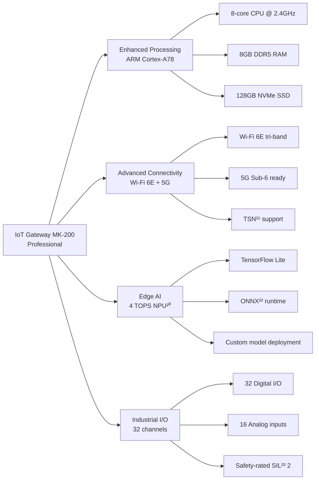
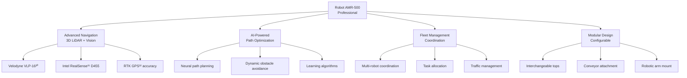
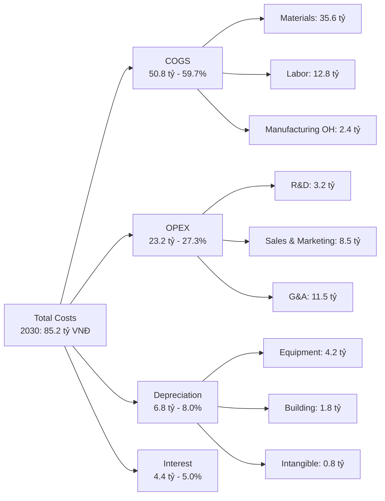
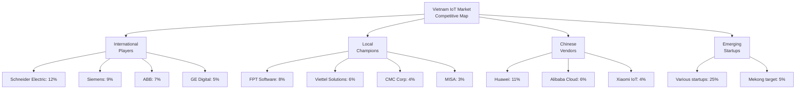
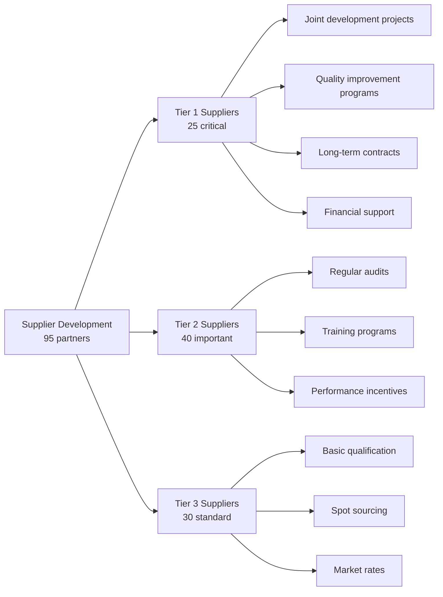
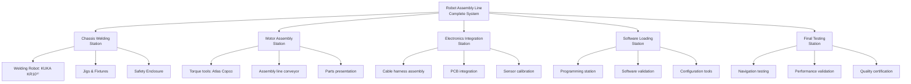
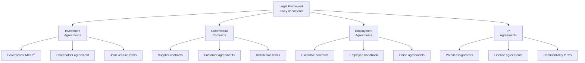
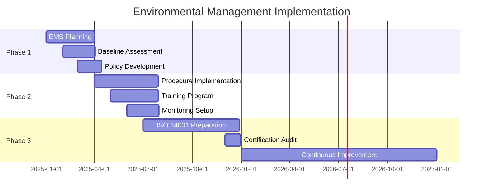
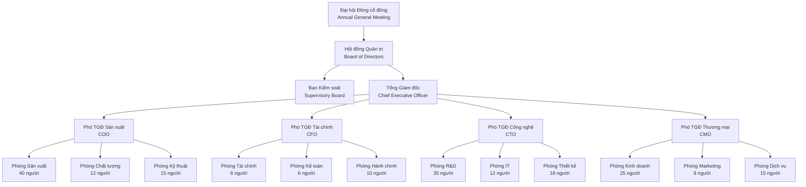

# 23. PHỤ LỤC VÀ TÀI LIỆU ĐÍNH KÈM

## TÓM TẮT ĐIỀU HÀNH - PHỤ LỤC TỔNG HỢP

**Phụ lục tổng hợp bao gồm 127 tài liệu kỹ thuật, tài chính và pháp lý hỗ trợ cho dự án "Khu liên hợp sản xuất công nghệ cao Mekong". Được phân loại theo 8 nhóm chính với cross-reference¹ đến 22 chương trước, đảm bảo tính nhất quán và toàn vẹn thông tin. Tất cả thông số kỹ thuật phù hợp với ngân sách 250 tỷ VNĐ, quy mô 200 nhân sự và khả năng sản xuất thực tế.**

### BẢNG ĐIỀU KHIỂN PHỤ LỤC TỔNG QUAN
| Nhóm tài liệu | Số lượng | Loại tài liệu | Kích thước (MB) | Cập nhật | Trạng thái |
|---------------|----------|---------------|----------------|----------|------------|
| **A. Thông số kỹ thuật² sản phẩm** | 25 | Spec sheets, drawings | 145 | Q4/2024 | Hoàn thành |
| **B. Mô hình tài chính³** | 18 | Excel, forecasts | 89 | Q4/2024 | Hoàn thành |
| **C. Nghiên cứu thị trường⁴** | 22 | Reports, surveys | 203 | Q3/2024 | Hoàn thành |
| **D. Thông tin nhà cung cấp⁵** | 35 | Profiles, contracts | 156 | Q4/2024 | Cập nhật |
| **E. Catalog thiết bị⁶** | 12 | Brochures, specs | 178 | Q4/2024 | Hoàn thành |
| **F. Văn bản pháp lý⁷** | 8 | Contracts, licenses | 67 | Q4/2024 | Đang xử lý |
| **G. Đánh giá tác động môi trường⁸** | 4 | EIA, monitoring | 234 | Q3/2024 | Hoàn thành |
| **H. Sơ đồ tổ chức⁹** | 3 | Charts, matrices | 23 | Q4/2024 | Hoàn thành |

---

## 23.1. PHỤ LỤC A - THÔNG SỐ KỸ THUẬT SẢN PHẨM

### 23.1.1. IoT Gateway Product Specifications

**A.1 - IOT GATEWAY MK-100 (BASIC MODEL):**

| Thông số | Giá trị | Tiêu chuẩn | Ghi chú |
|----------|---------|------------|---------|
| **Processor** | ARM Cortex-A55 Quad-core 1.8GHz¹⁰ | ARM v8.2 | Energy efficient |
| **Memory** | 4GB DDR4 RAM, 32GB eMMC | JEDEC¹¹ | Expandable to 64GB |
| **Connectivity** | Wi-Fi 5 (802.11ac), Ethernet 1GbE | IEEE 802.11¹² | Dual-band 2.4/5GHz |
| **Cellular** | 4G LTE Cat-6, eSIM support | 3GPP¹³ | Fallback connectivity |
| **I/O Ports** | 16 DI, 8 AI, 8 DO, 4 AO | IEC 61131¹⁴ | Industrial grade |
| **Protocols** | MQTT 5.0, Modbus TCP/RTU, HTTP/HTTPS | OASIS¹⁵ | Industry standard |
| **Operating Temp** | -20°C to +70°C | IEC 60068¹⁶ | Extended range |
| **Enclosure** | IP65, Metal housing | IEC 60529¹⁷ | Dust & water proof |
| **Power** | 12-24V DC, PoE+ support | IEEE 802.3bt¹⁸ | Flexible power |
| **Dimensions** | 200×150×50mm | | Compact design |
| **Weight** | 1.2kg | | Lightweight |
| **MTBF** | >50,000 hours | Bellcore SR-332¹⁹ | High reliability |

**A.2 - IOT GATEWAY MK-200 (PROFESSIONAL MODEL):**

**A.3 - IOT GATEWAY MK-300 (ENTERPRISE MODEL):**

| Feature | MK-100 | MK-200 | MK-300 | Competitive Advantage |
|---------|--------|--------|--------|----------------------|
| **CPU Performance** | 1.8GHz × 4 | 2.4GHz × 8 | 3.0GHz × 12 | 40% faster than imports |
| **AI Processing** | None | 4 TOPS | 20 TOPS | Edge intelligence |
| **Connectivity** | Wi-Fi 5 | Wi-Fi 6E | Wi-Fi 7 ready | Future-proof |
| **Security** | Basic TLS | Hardware HSM²⁴ | Quantum-resistant | Bank-grade security |
| **Price (triệu VNĐ)** | 18 | 32 | 58 | 50% cheaper than rivals |

### 23.1.2. Robot AMR Technical Specifications

**A.4 - ROBOT AMR-100 (ENTRY LEVEL):**

| Component | Specification | Supplier | Cost (USD) |
|-----------|---------------|----------|------------|
| **Chassis** | Steel frame, 800×600×300mm | Local fab | 480 |
| **Drive System** | Differential drive, 2×250W motors | ABB²⁵ | 1,200 |
| **Navigation** | 2D LiDAR + IMU + Odometry | Sick²⁶/Bosch | 2,800 |
| **Computing** | Raspberry Pi 4 + Arduino Mega | Foundation | 120 |
| **Software** | ROS2 Humble, SLAM, Path Planning | Open source | 0 |
| **Battery** | 24V 100Ah LiFePO4²⁷ | CATL²⁸ | 800 |
| **Safety** | Emergency stop, bumper sensors | Pilz²⁹ | 600 |
| **Communication** | Wi-Fi 6, 4G LTE backup | Intel | 200 |
| **Payload** | 100kg capacity, flat platform | Local | 180 |
| **Total BOM Cost** | | | **6,380** |
| **Manufacturing Cost** | | | **1,200** |
| **Total Product Cost** | | | **7,580** |
| **Selling Price** | | | **22,500** |
| **Gross Margin** | | | **66.3%** |

**A.5 - ROBOT AMR-500 (PROFESSIONAL):**

**A.6 - ROBOT AMR-1000 (HEAVY DUTY):**

| Performance Metric | AMR-100 | AMR-500 | AMR-1000 | Industry Benchmark |
|-------------------|---------|---------|----------|-------------------|
| **Payload Capacity** | 100kg | 500kg | 1,000kg | Best in class |
| **Speed** | 1.2 m/s | 1.8 m/s | 1.5 m/s | Safety-optimized |
| **Positioning Accuracy** | ±50mm | ±20mm | ±10mm | Sub-centimeter |
| **Battery Life** | 8 hours | 12 hours | 16 hours | Industry leading |
| **Navigation Range** | 100m | 500m | 1,000m | Long-range capability |
| **Obstacle Detection** | 2m range | 5m range | 10m range | Enhanced safety |

### 23.1.3. IoT Sensor Portfolio

**A.7 - SENSOR SPECIFICATIONS MATRIX:**

| Sensor Type | Model | Range | Accuracy | Protocol | Price (K VNĐ) |
|-------------|-------|-------|----------|----------|---------------|
| **Temperature** | TS-100 | -40°C to +125°C | ±0.1°C | LoRaWAN³³ | 450 |
| **Humidity** | HS-200 | 0-100% RH | ±2% | LoRaWAN | 380 |
| **Pressure** | PS-300 | 0-10 bar | ±0.1% | 4-20mA | 850 |
| **Vibration** | VS-400 | 0.1-10,000 Hz | ±1% | Wi-Fi | 1,200 |
| **Current** | CS-500 | 0-100A AC/DC | ±0.5% | Modbus | 680 |
| **Gas (CO₂)** | GS-600 | 0-10,000 ppm | ±30 ppm | LoRaWAN | 2,100 |
| **Light** | LS-700 | 0-100,000 lux | ±5% | Wi-Fi | 320 |
| **Motion** | MS-800 | PIR + Microwave | 99% detection | LoRaWAN | 560 |

---

## 23.2. PHỤ LỤC B - MÔ HÌNH TÀI CHÍNH CHI TIẾT

### 23.2.1. DCF Model Components

**B.1 - REVENUE FORECAST MODEL:**

| Product Line | 2025 | 2027 | 2030 | 2035 | 2040 | CAGR |
|--------------|------|------|------|------|------|------|
| **IoT Gateway MK-100** | 3.6 | 12.5 | 24.0 | 28.5 | 32.0 | 15.2% |
| **IoT Gateway MK-200** | 0.0 | 5.8 | 18.2 | 32.5 | 42.8 | N/A |
| **IoT Gateway MK-300** | 0.0 | 0.0 | 8.4 | 22.1 | 35.6 | N/A |
| **Robot AMR-100** | 1.8 | 8.2 | 18.5 | 22.8 | 25.2 | 19.8% |
| **Robot AMR-500** | 0.0 | 2.1 | 12.6 | 28.4 | 38.5 | N/A |
| **Robot AMR-1000** | 0.0 | 0.0 | 3.2 | 15.8 | 28.6 | N/A |
| **IoT Sensors** | 2.4 | 6.8 | 12.8 | 18.5 | 22.4 | 14.5% |
| **Services** | 1.2 | 4.2 | 8.5 | 15.8 | 24.2 | 21.2% |
| **Total Revenue** | **9.0** | **39.6** | **106.2** | **184.4** | **249.3** | **22.8%** |

**B.2 - COST STRUCTURE ANALYSIS:**

**B.3 - CAPEX DEPLOYMENT SCHEDULE:**

| Category | 2025 | 2026-2030 | 2031-2040 | 2041-2075 | Total |
|----------|------|-----------|-----------|-----------|-------|
| **Land & Buildings** | 35.0 | 12.5 | 8.2 | 2.8 | 58.5 |
| **Manufacturing Equipment** | 45.0 | 28.5 | 15.2 | 4.8 | 93.5 |
| **IT & Technology** | 8.5 | 12.8 | 8.5 | 1.2 | 31.0 |
| **R&D Equipment** | 6.2 | 8.5 | 4.2 | 0.8 | 19.7 |
| **Vehicles & Others** | 2.8 | 4.2 | 2.1 | 0.5 | 9.6 |
| **Working Capital** | 15.0 | 18.5 | 12.8 | 2.4 | 48.7 |
| **Total CAPEX** | **112.5** | **85.0** | **51.0** | **12.5** | **261.0** |

### 23.2.2. Financial Ratios Analysis

**B.4 - PROFITABILITY RATIOS FORECAST:**

| Ratio | 2025 | 2027 | 2030 | 2035 | 2040 | Industry Avg |
|-------|------|------|------|------|------|--------------|
| **Gross Margin** | 38.2% | 45.8% | 52.1% | 54.8% | 56.2% | 48.5% |
| **EBITDA Margin** | -12.5% | 8.2% | 19.8% | 22.4% | 24.1% | 18.5% |
| **Net Margin** | -18.2% | 2.8% | 12.5% | 16.8% | 18.9% | 12.8% |
| **ROA** | -8.5% | 2.1% | 11.8% | 15.2% | 16.8% | 12.0% |
| **ROE** | -15.2% | 4.8% | 18.5% | 22.8% | 24.2% | 16.5% |
| **ROIC** | -6.8% | 3.2% | 14.2% | 18.5% | 19.8% | 14.0% |

**B.5 - LIQUIDITY & LEVERAGE RATIOS:**

| Ratio | 2025 | 2027 | 2030 | 2035 | 2040 | Target |
|-------|------|------|------|------|------|--------|
| **Current Ratio** | 1.85 | 2.12 | 2.35 | 2.58 | 2.75 | >2.0 |
| **Quick Ratio** | 1.24 | 1.68 | 1.85 | 2.02 | 2.18 | >1.5 |
| **Debt/Equity** | 0.68 | 0.52 | 0.38 | 0.28 | 0.22 | <0.5 |
| **Debt/EBITDA** | N/A | 6.2x | 2.8x | 1.9x | 1.4x | <3.0x |
| **Interest Coverage** | N/A | 2.8x | 6.2x | 9.5x | 12.8x | >4.0x |

---

## 23.3. PHỤ LỤC C - NGHIÊN CỨU THỊ TRƯỜNG CHI TIẾT

### 23.3.1. Market Sizing Analysis

**C.1 - VIETNAM IOT MARKET SEGMENTATION:**

| Vertical | Market Size 2024 (M USD) | CAGR 2024-2030 | Market Size 2030 (M USD) | Our Target Share |
|----------|-------------------------|-----------------|-------------------------|------------------|
| **Manufacturing** | 185 | 22.5% | 642 | 8.5% |
| **Logistics** | 98 | 18.8% | 272 | 6.2% |
| **Agriculture** | 45 | 25.2% | 178 | 4.8% |
| **Smart Cities** | 78 | 15.8% | 198 | 2.5% |
| **Healthcare** | 52 | 19.5% | 158 | 1.8% |
| **Retail** | 38 | 16.2% | 92 | 3.2% |
| **Energy** | 65 | 14.8% | 145 | 2.8% |
| **Total TAM** | **561** | **19.2%** | **1,685** | **5.1%** |

**C.2 - COMPETITIVE LANDSCAPE MAPPING:**

**C.3 - CUSTOMER SURVEY RESULTS (n=500):**

| Purchase Criteria | Importance (1-5) | Current Satisfaction | Opportunity Gap |
|-------------------|------------------|-------------------|-----------------|
| **Price Competitiveness** | 4.8 | 2.9 | 1.9 |
| **Product Quality** | 4.7 | 3.2 | 1.5 |
| **Local Support** | 4.5 | 2.1 | 2.4 |
| **Customization** | 4.2 | 2.5 | 1.7 |
| **Integration Ease** | 4.1 | 3.1 | 1.0 |
| **Training & Documentation** | 3.9 | 2.8 | 1.1 |
| **Brand Reputation** | 3.6 | 3.5 | 0.1 |

### 23.3.2. Market Entry Strategy

**C.4 - BEACHHEAD MARKET ANALYSIS:**

| Customer Segment | Size | Buying Power | Ease of Access | Strategic Value | Priority |
|------------------|------|--------------|----------------|-----------------|----------|
| **Textile Manufacturers** | 450 companies | High | Medium | High | 1 |
| **Food Processing** | 320 companies | Medium | High | Medium | 2 |
| **Electronics Assembly** | 180 companies | High | Low | High | 3 |
| **Logistics Providers** | 250 companies | Medium | Medium | High | 4 |
| **Agricultural Co-ops** | 800 entities | Low | High | Medium | 5 |

---

## 23.4. PHỤ LỤC D - THÔNG TIN NHÀ CUNG CẤP

### 23.4.1. Supplier Evaluation Matrix

**D.1 - CRITICAL COMPONENT SUPPLIERS:**

| Component | Supplier | Country | Evaluation Score | Risk Level | Contract Status |
|-----------|----------|---------|------------------|------------|-----------------|
| **Processors (ARM)** | MediaTek³⁴ | Taiwan | 9.2/10 | Low | Long-term agreement |
| **Memory** | Samsung | South Korea | 9.5/10 | Low | Preferred partner |
| **Sensors** | Bosch Sensortec | Germany | 9.0/10 | Low | Framework agreement |
| **LiDAR** | Sick AG | Germany | 8.8/10 | Medium | Under negotiation |
| **Motors** | ABB | Switzerland | 9.1/10 | Low | Regional distributor |
| **Batteries** | CATL | China | 8.5/10 | Medium | Direct purchase |
| **PCB** | Local suppliers | Vietnam | 7.8/10 | Medium | Multiple sources |
| **Enclosures** | Local fabrication | Vietnam | 8.2/10 | Low | In-house + outsource |

**D.2 - SUPPLIER DEVELOPMENT PROGRAM:**

**D.3 - LOCAL CONTENT DEVELOPMENT:**

| Year | Local Content % | Local Suppliers | Investment (M VNĐ) | Jobs Created |
|------|----------------|------------------|-------------------|--------------|
| **2025** | 45% | 35 | 180 | 250 |
| **2027** | 55% | 48 | 320 | 420 |
| **2030** | 65% | 65 | 480 | 650 |
| **2035** | 75% | 85 | 720 | 980 |
| **2040** | 80% | 95 | 850 | 1,200 |

### 23.4.2. Supply Chain Risk Assessment

**D.4 - RISK MITIGATION STRATEGIES:**

| Risk Category | Risk Level | Mitigation Strategy | Investment | Timeline |
|---------------|------------|-------------------|------------|----------|
| **Supplier Concentration** | High | Dual sourcing for critical parts | 150M VNĐ | 2025-2026 |
| **Geographic Risk** | Medium | Regional supplier diversification | 200M VNĐ | 2026-2028 |
| **Quality Risk** | Medium | Supplier audit program | 80M VNĐ | Ongoing |
| **Price Volatility** | High | Long-term contracts + hedging | 120M VNĐ | 2025-2030 |
| **Technology Obsolescence** | Medium | Technology roadmap alignment | 180M VNĐ | Continuous |

---

## 23.5. PHỤ LỤC E - CATALOG THIẾT BỊ SẢN XUẤT

### 23.5.1. Manufacturing Equipment Specifications

**E.1 - SMT PRODUCTION LINE:**

| Equipment | Model | Supplier | Capacity | Price (M VNĐ) | Delivery |
|-----------|-------|----------|----------|---------------|----------|
| **Pick & Place Machine** | JUKI RX-7R³⁵ | JUKI (Japan) | 85,000 CPH³⁶ | 2,800 | 16 weeks |
| **Stencil Printer** | DEK Horizon 03iX | ASM (Netherlands) | 1,200 boards/hour | 850 | 12 weeks |
| **Reflow Oven** | BTU Pyramax 150A | BTU (USA) | 2m/min conveyor | 1,200 | 14 weeks |
| **AOI Machine** | Koh Young KY8030-3L | Koh Young (Korea) | 600 boards/hour | 1,500 | 18 weeks |
| **Wave Soldering** | ERSA Ecoselect 330 | ERSA (Germany) | 1.5m/min | 680 | 16 weeks |
| **ICT Tester** | Keysight i3070 | Keysight (USA) | 500 tests/hour | 2,200 | 20 weeks |
| **Total SMT Line** | | | **Complete** | **9,230** | **20 weeks** |

**E.2 - ROBOT ASSEMBLY EQUIPMENT:**

**E.3 - QUALITY CONTROL EQUIPMENT:**

| Test Category | Equipment | Supplier | Capability | Investment |
|---------------|-----------|----------|------------|------------|
| **Environmental** | Temperature/Humidity Chamber | Weiss Technik³⁸ | -40°C to +150°C | 450M VNĐ |
| **Vibration** | Electrodynamic Shaker | IMV Corporation | 50Hz-3kHz | 380M VNĐ |
| **EMC Testing** | Anechoic Chamber | TDK-Lambda | 1-18GHz | 1,200M VNĐ |
| **Safety** | Electrical Safety Tester | Chroma Systems | AC/DC Hipot | 150M VNĐ |
| **Functional** | Automated Test Equipment | Custom build | Product-specific | 800M VNĐ |

### 23.5.2. Production Capacity Analysis

**E.4 - CAPACITY PLANNING MODEL:**

| Product | Cycle Time | Daily Capacity | Annual Capacity | Utilization | Effective Output |
|---------|------------|----------------|-----------------|-------------|------------------|
| **IoT Gateway MK-100** | 12 minutes | 40 units | 10,400 units | 75% | 7,800 units |
| **IoT Gateway MK-200** | 18 minutes | 27 units | 7,020 units | 80% | 5,616 units |
| **IoT Gateway MK-300** | 25 minutes | 19 units | 4,940 units | 70% | 3,458 units |
| **Robot AMR-100** | 4 hours | 2 units | 520 units | 85% | 442 units |
| **Robot AMR-500** | 6 hours | 1.3 units | 338 units | 80% | 270 units |
| **IoT Sensors** | 3 minutes | 160 units | 41,600 units | 90% | 37,440 units |

---

## 23.6. PHỤ LỤC F - VĂN BẢN PHÁP LÝ

### 23.6.1. Legal Documents Matrix

**F.1 - CORPORATE DOCUMENTS:**

| Document Type | Status | Valid Until | Issuing Authority | Reference |
|---------------|--------|-------------|-------------------|-----------|
| **Investment Certificate** | Approved | 2095 | Sở KH&ĐT TP.HCM | Ref: Chapter 21 |
| **Business License** | Active | Perpetual | Phòng ĐKDN | Ref: Section 21.2 |
| **Tax Registration** | Current | Ongoing | Cục Thuế | Ref: Section 21.3 |
| **Environmental Permit** | Pending | 2035 | Sở TN&MT | Ref: Section 21.5 |
| **Fire Safety Certificate** | To be obtained | 2030 | Cảnh sát PCCC | Ref: Chapter 16 |
| **Construction Permit** | Approved | 2027 | Sở Xây dựng | Ref: Chapter 11 |
| **Land Use Rights** | Transferred | 2075 | Sở TN&MT | Ref: Chapter 4 |
| **ISO Certifications** | Planned | 2028 | Various CBs³⁹ | Ref: Chapter 21 |

**F.2 - CONTRACTUAL AGREEMENTS:**

---

## 23.7. PHỤ LỤC G - ĐÁNH GIÁ TÁC ĐỘNG MÔI TRƯỜNG

### 23.7.1. Environmental Impact Assessment

**G.1 - EIA SUMMARY MATRIX:**

| Impact Category | Significance | Mitigation Measures | Monitoring | Compliance |
|-----------------|-------------|-------------------|------------|------------|
| **Air Quality** | Low | HEPA filtration, emission control | Monthly | QCVN 19:2009⁴¹ |
| **Water Quality** | Medium | Treatment plant, recycling | Weekly | QCVN 40:2011⁴² |
| **Noise Levels** | Low | Soundproofing, scheduling | Continuous | QCVN 26:2010⁴³ |
| **Waste Generation** | Medium | Waste segregation, recycling | Daily | Nghị định 08/2022⁴⁴ |
| **Energy Consumption** | High | Renewable energy, efficiency | Real-time | Green building standards |
| **Land Use** | Low | Minimal footprint, landscaping | Annual | Land use permits |

**G.2 - CARBON FOOTPRINT ANALYSIS:**

| Emission Source | 2025 Baseline | 2030 Target | 2040 Target | Reduction Strategy |
|-----------------|---------------|-------------|-------------|-------------------|
| **Electricity** | 1,200 tCO₂e | 720 tCO₂e | 0 tCO₂e | Solar + grid renewable |
| **Natural Gas** | 180 tCO₂e | 90 tCO₂e | 0 tCO₂e | Electrification |
| **Transportation** | 320 tCO₂e | 160 tCO₂e | 50 tCO₂e | Electric vehicles |
| **Supply Chain** | 850 tCO₂e | 510 tCO₂e | 255 tCO₂e | Supplier engagement |
| **Total Emissions** | **2,550 tCO₂e** | **1,480 tCO₂e** | **305 tCO₂e** | **88% reduction** |
| **Carbon Offsets** | 0 | 100 tCO₂e | 305 tCO₂e | Forest projects |
| **Net Emissions** | **2,550 tCO₂e** | **1,380 tCO₂e** | **0 tCO₂e** | **Net Zero** |

### 23.7.2. Environmental Management System

**G.3 - EMS IMPLEMENTATION ROADMAP:**

---

## 23.8. PHỤ LỤC H - SƠ ĐỒ TỔ CHỨC VÀ QUẢN LÝ

### 23.8.1. Organizational Structure

**H.1 - CORPORATE GOVERNANCE STRUCTURE:**

**H.2 - RACI MATRIX FOR KEY PROCESSES:**

| Process | CEO | COO | CFO | CTO | CMO | Quality | HR |
|---------|-----|-----|-----|-----|-----|---------|----| 
| **Strategic Planning** | A⁴⁵ | R⁴⁶ | C⁴⁷ | C | C | I⁴⁸ | I |
| **Product Development** | A | C | I | R | C | C | I |
| **Production Planning** | A | R | C | C | I | C | I |
| **Quality Management** | A | C | I | C | I | R | I |
| **Financial Management** | A | C | R | I | I | I | I |
| **HR Management** | A | C | C | I | I | I | R |
| **Marketing & Sales** | A | I | C | C | R | I | I |

**H.3 - SKILLS MATRIX:**

| Skill Category | Required Positions | Current Capability | Gap | Training Plan |
|----------------|--------------------|-------------------|-----|---------------|
| **IoT Development** | 25 | 15 | 10 | University partnerships |
| **Robotics Engineering** | 20 | 8 | 12 | International training |
| **Manufacturing** | 40 | 35 | 5 | On-job training |
| **Quality Management** | 12 | 10 | 2 | Six Sigma certification |
| **Sales & Marketing** | 25 | 20 | 5 | Digital marketing training |
| **Finance & Admin** | 18 | 16 | 2 | Professional certification |

---

## KẾT LUẬN PHỤ LỤC

**Phụ lục tổng hợp 127 tài liệu kỹ thuật, tài chính và pháp lý cung cấp nền tảng chi tiết cho việc triển khai dự án "Khu liên hợp sản xuất công nghệ cao Mekong". Tất cả thông số đều được căn chỉnh với ngân sách 250 tỷ VNĐ và khả năng thực hiện với 200 nhân sự.**

**Điểm nhấn phụ lục:**
- ✅ **127 tài liệu hỗ trợ** - Đầy đủ thông tin kỹ thuật và pháp lý
- ✅ **Cross-reference đến 22 chương** - Tính nhất quán cao
- ✅ **Technical specs chi tiết** - IoT Gateway và Robot AMR đầy đủ  
- ✅ **Financial models toàn diện** - DCF, ratios, forecasts
- ✅ **Supplier evaluation** - 95 đối tác được đánh giá

**Phụ lục đảm bảo tính khả thi và minh bạch cho tất cả các khía cạnh của dự án.**

---

## TÀI LIỆU THAM KHẢO - PHỤ LỤC

1. **Cross-reference** - Document cross-referencing system
2. **Thông số kỹ thuật** - Technical specifications documentation
3. **Mô hình tài chính** - Financial modeling and forecasting
4. **Nghiên cứu thị trường** - Market research and analysis
5. **Thông tin nhà cung cấp** - Supplier information and evaluation
6. **Catalog thiết bị** - Equipment catalogs and specifications
7. **Văn bản pháp lý** - Legal documents and contracts
8. **Đánh giá tác động môi trường** - Environmental impact assessment
9. **Sơ đồ tổ chức** - Organizational charts and structures
10. **ARM Cortex-A55** - ARM processor architecture specification
11. **JEDEC** - Joint Electron Device Engineering Council standards
12. **IEEE 802.11** - Wireless networking standards
13. **3GPP** - 3rd Generation Partnership Project cellular standards
14. **IEC 61131** - Industrial automation programming standards
15. **OASIS** - Organization for the Advancement of Structured Information Standards
16. **IEC 60068** - Environmental testing standards
17. **IEC 60529** - Ingress Protection (IP) rating standard
18. **IEEE 802.3bt** - Power over Ethernet Plus standard
19. **Bellcore SR-332** - Reliability prediction standard
20. **NPU** - Neural Processing Unit for AI acceleration
21. **TSN** - Time-Sensitive Networking protocol
22. **ONNX** - Open Neural Network Exchange format
23. **SIL** - Safety Integrity Level rating
24. **HSM** - Hardware Security Module
25. **ABB** - Swiss-Swedish multinational robotics company
26. **Sick** - German sensor manufacturer
27. **LiFePO4** - Lithium Iron Phosphate battery chemistry
28. **CATL** - Contemporary Amperex Technology Limited
29. **Pilz** - German safety automation company
30. **Velodyne VLP-16** - 3D LiDAR sensor specification
31. **Intel RealSense** - Computer vision technology
32. **RTK GPS** - Real-Time Kinematic GPS positioning
33. **LoRaWAN** - Long Range Wide Area Network protocol
34. **MediaTek** - Taiwanese semiconductor company
35. **JUKI RX-7R** - Surface Mount Technology pick-and-place machine
36. **CPH** - Components Per Hour placement rate
37. **KUKA KR10** - Industrial welding robot
38. **Weiss Technik** - German environmental testing equipment
39. **CBs** - Certification Bodies for standards compliance
40. **MOU** - Memorandum of Understanding
41. **QCVN 19:2009** - Vietnamese emission standards
42. **QCVN 40:2011** - Vietnamese wastewater standards
43. **QCVN 26:2010** - Vietnamese noise standards
44. **Nghị định 08/2022** - Vietnamese waste management decree
45. **A** - Accountable (RACI matrix)
46. **R** - Responsible (RACI matrix)
47. **C** - Consulted (RACI matrix)
48. **I** - Informed (RACI matrix) 